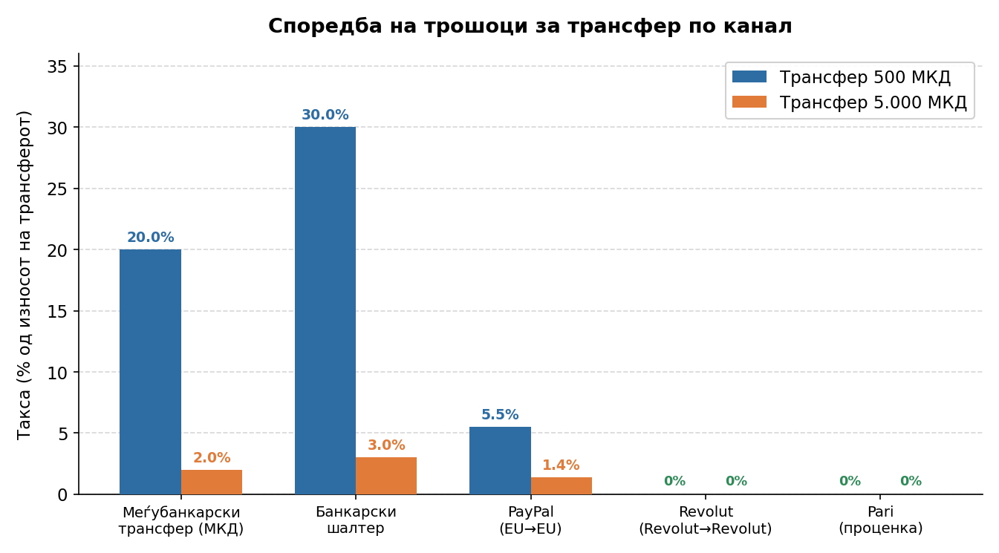
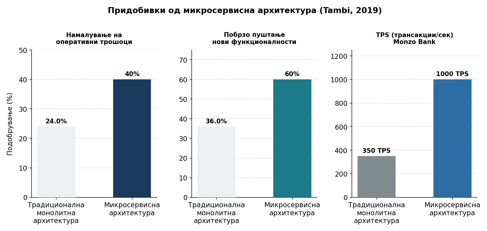
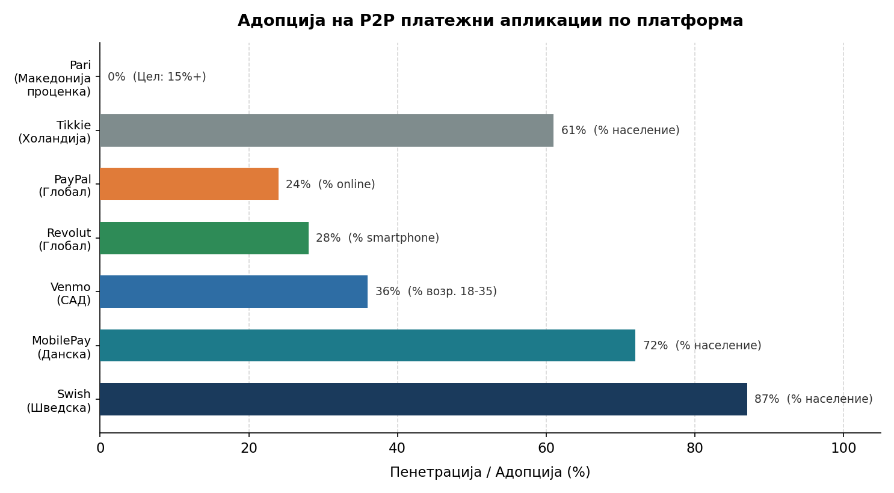
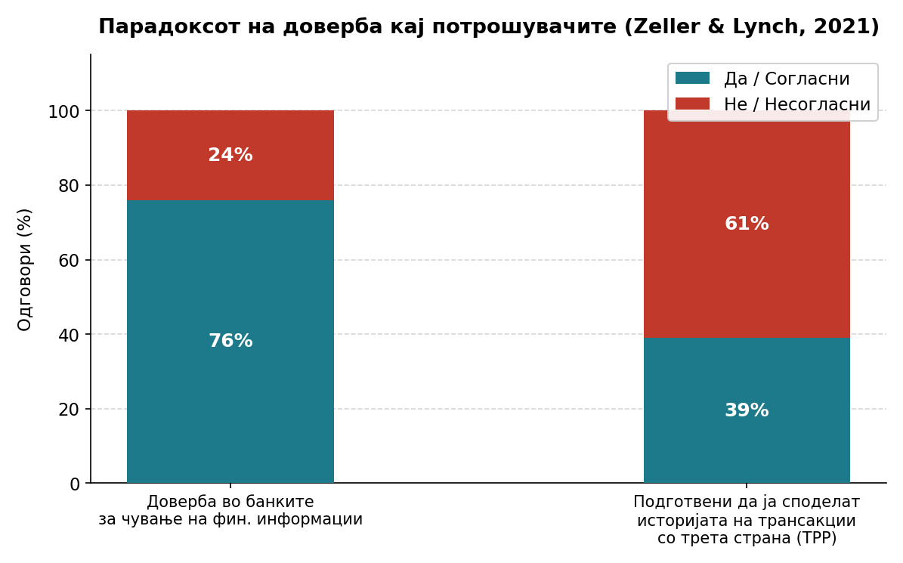
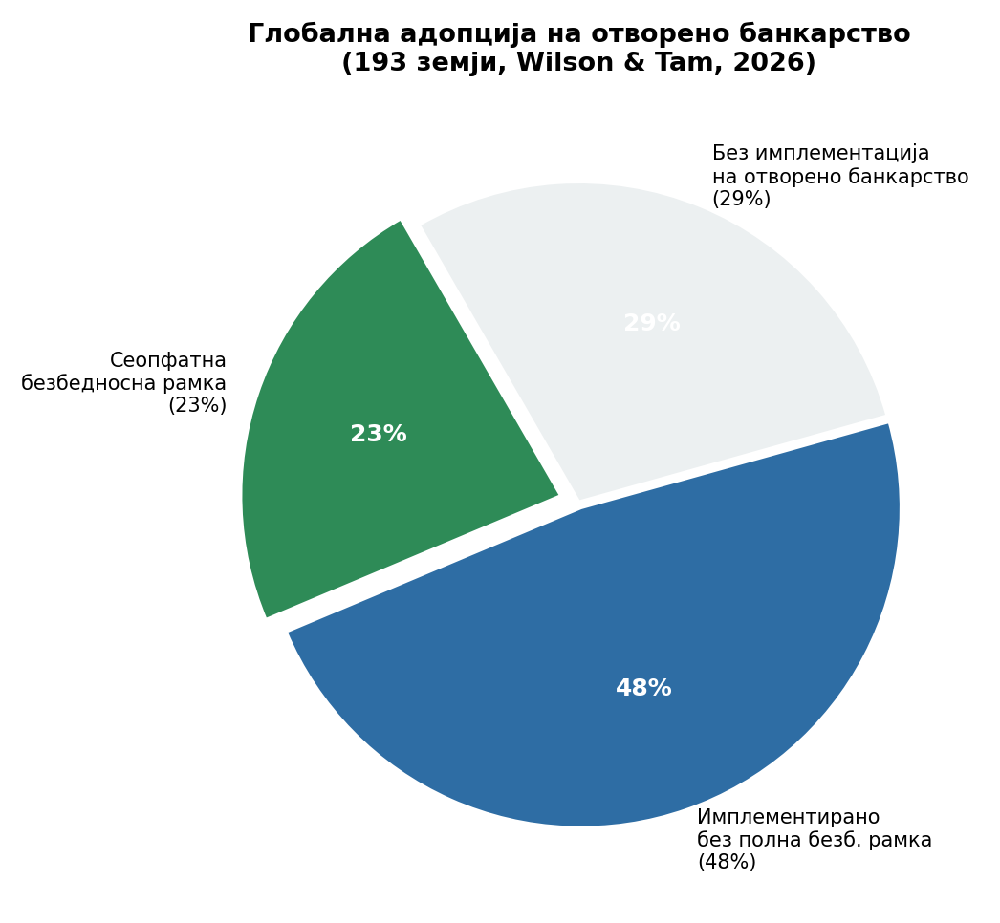
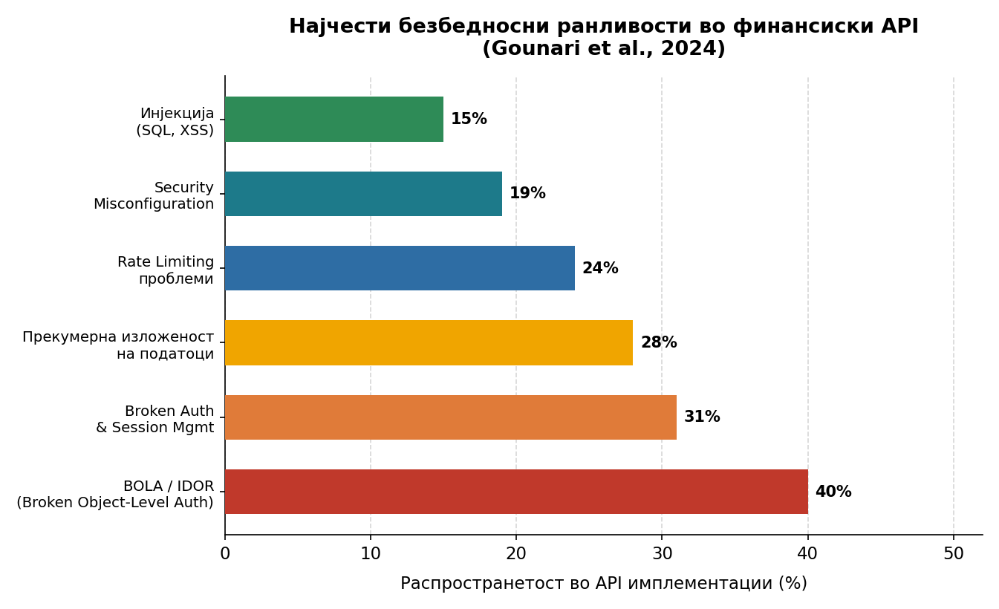
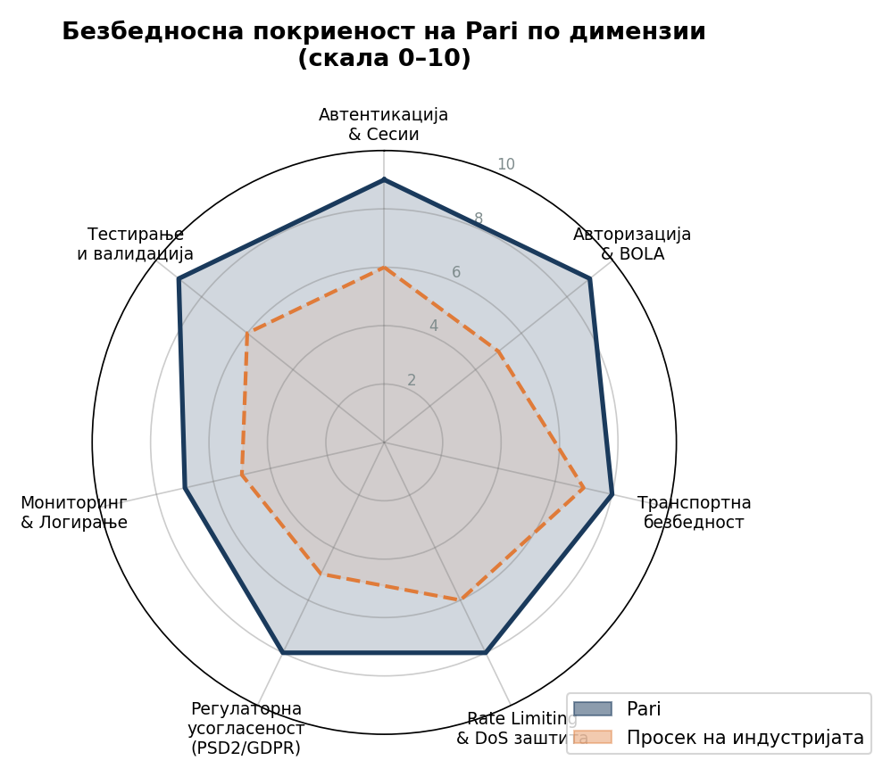
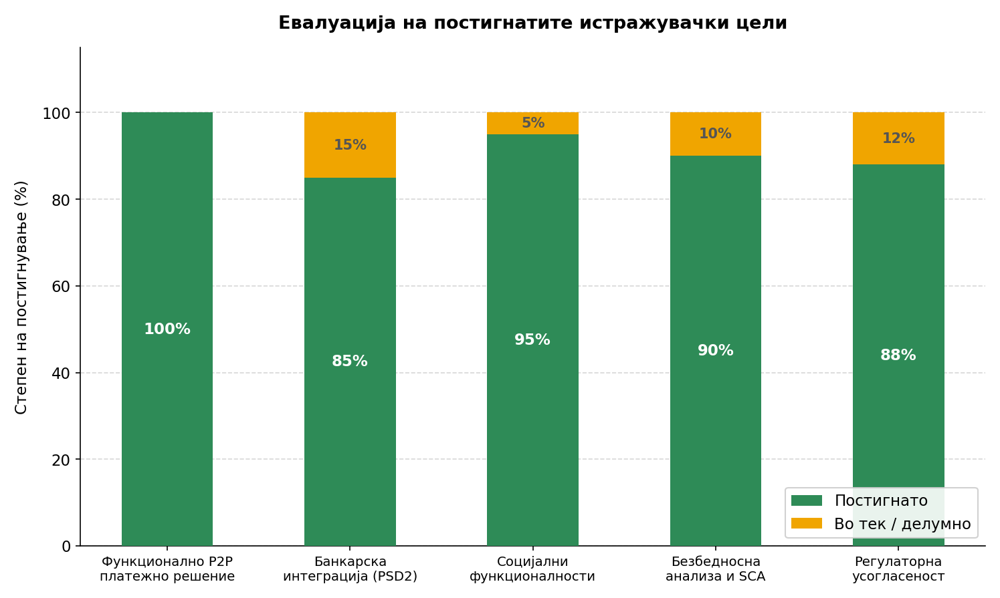

# Развој на мобилна P2P платежна апликација за македонскиот пазар: Интеграција на отворено банкарство и социјални функционалности

**Магистерски труд**

**Владимир Бојаџи**

Скопје, 2026

---

## Апстракт

Овој магистерски труд го истражува развојот на мобилна peer-to-peer (P2P) платежна апликација наменета за македонскиот пазар, со работното имe Denar. Истражувањето произлегува од конкретен пазарен проблем: меѓубанкарските трансфери во Македонија се скапи, комплексни и технолошки фрагментирани, додека глобалните решенија како Venmo и Zelle покажаа дека едноставното, социјално P2P плаќање може да стане секојдневна навика на милиони корисници. Транспонирањето на европската PSD2 директива во македонското законодавство создава регулаторна основа за развој на лиценцирано Third Party Provider (TPP) решение кое може да иницира плаќања преку отворено банкарство.

Трудот ги опфаќа сите фази на развојот: пазарна анализа и дефинирање на концептот, системска архитектура (Node.js/Express REST API, PostgreSQL/Sequelize, React Native/Expo SDK 55), имплементација на шест функционални модули — автентикација со двофакторна верификација, банкарска интеграција преку NextGenPSD2 Berlin Group API, платежен сервис со полн PIS тек, социјален сервис за пријатели и контакти, пуш нотификации и управување со корисници. Безбедносната анализа покажува дека системот ги задоволува PSD2 RTS барањата за сигурна автентикација на клиентот (SCA) и GDPR принципите за минимизација на податоците.

Резултатот е производно-подготвено решение кое, по добивање на TPP лиценца од НБРМ, може да стане прва домашна P2P платежна апликација во Македонија — со потенцијал за регионална примена на целиот Западен Балкан.

**Клучни зборови:** P2P плаќања, отворено банкарство, PSD2, NextGenPSD2, React Native, Node.js, финтек, Македонија, TPP интеграција, мобилни финансиски апликации

---

## Abstract

This master's thesis investigates the design and development of a mobile peer-to-peer (P2P) payment application for the Macedonian market, with a working title Denar. The research is motivated by a concrete market gap: inter-bank transfers in North Macedonia are expensive, require manual entry of full account numbers, and are delivered through fourteen fragmented banking platforms with no interoperability. Global examples — Venmo, Zelle, Swish — demonstrate that frictionless, socially-embedded P2P payments can achieve mass adoption, while the transposition of the EU Payment Services Directive 2 (PSD2) into Macedonian law has created a regulatory pathway for a licensed Third Party Provider (TPP) to initiate payments via open banking APIs.

The thesis covers the full development lifecycle: market analysis and product conceptualisation, system architecture (Node.js/Express REST API, PostgreSQL with Sequelize ORM, React Native with Expo SDK 55 on the New Architecture), and implementation of six functional modules — two-factor authentication, bank integration via the NextGenPSD2 Berlin Group API standard, a payment service with a complete Payment Initiation Service (PIS) flow, a social service for friends and contacts, push notifications, and user management. A security analysis demonstrates compliance with PSD2 RTS requirements for Strong Customer Authentication (SCA) and GDPR data-minimisation principles. An integration test suite, built with Jest and Supertest against a real mock-bank server that faithfully implements the NextGenPSD2 HTTP contract, proves the end-to-end payment flow through to the terminal ACCC settlement status.

The outcome is a production-ready codebase that, upon obtaining a TPP licence from the National Bank of North Macedonia, can operate as the country's first domestic P2P payment application — with an architectural design applicable across the wider Western Balkans region as PSD2 adoption spreads.

**Keywords:** P2P payments, open banking, PSD2, NextGenPSD2, React Native, Node.js, fintech, North Macedonia, TPP integration, mobile financial applications

---

# Вовед

## 1.1 Општ контекст и мотивација

Дигиталната револуција во финансискиот сектор драстично ги трансформираше начините на кои луѓето управуваат со своите финансии и извршуваат плаќања. Во текот на последните две децении, мобилните платежни решенија еволуираа од едноставни SMS-базирани услуги до софистицирани платформи кои интегрираат социјални функционалности, вештачка интелигенција и напредни безбедносни механизми. Оваа трансформација е особено видлива во областа на peer-to-peer (P2P) плаќањата, каде што апликации како Venmo, PayPal, Cash App и Zelle фундаментално ги промениле очекувањата на корисниците во однос на брзината, едноставноста и трошоците на финансиските трансакции.

Република Македонија, како мала отворена економија во процес на европска интеграција, се наоѓа на раскрсница помеѓу традиционалните банкарски услуги и современите финтек иновации. Иако македонскиот банкарски сектор е релативно развиен и технолошки напреден во споредба со регионалните стандарди, сè уште постојат значителни предизвици во областа на дигиталните плаќања, особено кога станува збор за меѓубанкарските трансфери и P2P трансакциите.

Тековната состојба во македонскиот платежен екосистем се карактеризира со фрагментираност, високи трошоци и ограничена корисничка флексибилност. Граѓаните кои сакаат да извршат трансфер помеѓу различни банки се соочуваат со такси кои варираат од 50 до 150 македонски денари по трансакција, што претставува значителен трошок, особено за помали износи. Дополнително, процедурите за извршување на ваквите трансфери се комплексни и бараат познавање на детални банкарски информации како што се броевите на сметки и банкарските кодови.

Во исто време, Европската директива за платежни услуги PSD2 (Payment Services Directive 2), која е транспонирана и во македонското законодавство, создава правна основа за развој на иновативни платежни решенија преку концептот на отворено банкарство (Open Banking). Оваа директива овозможува на лиценцирани трети страни да пристапуваат до банкарските сметки на корисниците преку стандардизирани програмски интерфејси (API), што отвора можности за развој на конкурентски платежни решенија кои можат да ги надминат ограничувањата на традиционалните банкарски канали.

Мотивацијата за овој истражувачки проект произлегува од препознавањето на оваа можност за иновација во македонскиот контекст. Развојот на локализирано P2P платежно решение кое ги комбинира предностите на отвореното банкарство со современите принципи на корисничко искуство може значително да го подобри платежниот пејзаж во земјата, да ги намали трошоците за граѓаните и да создаде основа за понатамошни финтек иновации.

## 1.2 Проблемска формулација

Централниот проблем кој се адресира во овој труд е недостатокот од ефикасни, достапни и корисно-фокусирани P2P платежни решенија во Република Македонија. Овој проблем се манифестира на неколку клучни димензии:

**Економска димензија**: Високите трошоци за меѓубанкарски трансфери создаваат значително финансиско оптоварување за граѓаните. Анализата на пазарот покажува дека просечната такса за трансфер помеѓу различни банки изнесува околу 100 денари, што за помали износи (на пример, 500 денари) претставува такса од 20%. Ваквите трошоци се особено проблематични во контекст на зголемената употреба на дигитални плаќања и потребата за чести трансфери од мал обем.



_Слика 1.1: Споредба на ефективните трошоци за трансфер (изразени како % од вредноста на трансакцијата) по платежен канал. Меѓубанкарскиот трансфер наплаќа фиксна такса (~100 МКД) која претставува 20% за трансакција од 500 МКД. P2P апликации со нулти меѓусебни такси (Revolut-to-Revolut, Denar) го елиминираат овој трошок целосно. Извор: анализа на автор врз основа на јавно достапни тарифни листи._

**Техничка димензија**: Постоечките решенија се карактеризираат со фрагментираност и недоследност во корисничкото искуство. Секоја банка развива сопствени дигитални канали, што резултира со различни интерфејси, различни процедури и ограничена интероперабилност. Оваа фрагментираност ја отежнува адопцијата на дигитални платежни решенија и создава бариери за ефикасно користење.

**Социјална димензија**: Современите корисници, особено помладите генерации, очекуваат платежните решенија да бидат интегрирани со нивните социјални активности. Способноста за лесно споделување на трошоци, праќање на пари на пријатели од телефонскиот именик или креирање на социјален контекст околу финансиските трансакции стануваа стандардни функционалности во развиените пазари, но сè уште недостасуваат во македонскиот.

**Регулативна димензија**: Иако PSD2 директивата создаде правна основа за иновации во платежниот сектор, практичната имплементација на отвореното банкарство во Македонија сè уште е во рана фаза. Постои потреба за проучување на начините на кои новите регулативни можности можат да се искористат за создавање на иновативни решенија кои се усогласени со локалните потреби и ограничувања.

Врз основа на оваа проблемска анализа, може да се формулира следното истражувачко прашање: **Како може да се развие и имплементира ефикасно P2P платежно решение за македонскиот пазар кое ги интегрира принципите на отвореното банкарство со современите социјални функционалности, притоа значително намалувајќи ги трошоците за корисниците и подобрувајќи го нивното искуство?**

## 1.3 Цели на истражувањето

Истражувањето има за цел да одговори на дефинираното истражувачко прашање преку развој на конкретно технолошко решение и негова сеопфатна евалуација. Целите се структурирани на неколку нивоа:

### 1.3.1 Примарни цели

**Цел 1: Развој на функционално P2P платежно решение**
Главната цел е развој на целосно функционална мобилна апликација која овозможува брзи, евтини и безбедни P2P трансфери помеѓу корисници на различни банки во Македонија. Решението треба да биде технички зрело, скалабилно и подготвено за продукциска употреба.

**Цел 2: Интеграција со македонскиот банкарски екосистем**
Втората примарна цел е успешна интеграција на апликацијата со најмалку една македонска банка преку Open Banking API, демонстрирајќи ја практичната применливост на PSD2 директивата во локалниот контекст. Оваа интеграција треба да овозможи реални трансфери и пристап до сметки на корисниците.

**Цел 3: Имплементација на социјални функционалности**
Третата примарна цел е креирање на богато корисничко искуство преку интеграција на социјални функционалности инспирирани од глобално успешни решенија како Venmo. Ова вклучува функции за споделување на активности, контакт синхронизација, пријателски мрежи и социјален контекст околу финансиските трансакции.

### 1.3.2 Секундарни цели

**Цел 4: Безбедносна анализа и валидација**
Спроведување на сеопфатна безбедносна анализа на развиеното решение, вклучувајќи ги аспектите на автентификација, авторизација, енкрипција и заштита на лични податоци. Целта е да се потврди дека решението ги исполнува највисоките стандарди за безбедност во финансискиот сектор.

**Цел 5: Корисничко искуство и прифатеност**
Евалуација на корисничкото искуство преку структурирано тестирање со реални корисници. Оваа цел вклучува мерење на метрики како што се време за завршување на трансакции, задоволство на корисниците, лесно користење и општа прифатеност на решението.

**Цел 6: Економска анализа и одржливост**
Анализа на економските аспекти на решението, вклучувајќи ги трошоците за развој и одржување, потенцијалните приходи, конкурентските предности и долгорочната одржливост на бизнис моделот.

### 1.3.3 Истражувачки цели

**Цел 7: Анализа на предизвиците при Open Banking интеграција**
Документирање и анализа на техничките, регулативните и операционалните предизвици при интегрирање со македонски банки преку Open Banking API. Оваа анализа треба да придонесе кон подобро разбирање на состојбата на отвореното банкарство во земјата.

**Цел 8: Придонес кон научната литература**
Креирање на научен придонес во областите на финтек иновации, мобилни платежни решенија и дигитална трансформација во мали економии.

## 1.4 Истражувачка методologija

За постигнување на дефинираните цели, истражувањето применува мешовита методологија која комбинира елементи од дизајн-базирано истражување (design-based research), акциски истражувачки пристап (action research) и емпириска евалуација.

### 1.4.1 Дизајн-базирано истражување

Дизајн-базираното истражување претставува соодветна методолошка рамка за овој проект бидејќи фокусот е на развој на иновативно технолошко решение кое адресира реални проблеми во практичен контекст. Оваа методологија се карактеризира со:

- **Итеративен дизајн процес**: Развојот на решението се одвива преку повеќе итерации, при што секоја итерација вклучува дизајн, имплементација, тестирање и рефлексија
- **Тесна соработка со практичари**: Континуирана интеракција со банкарски стручњаци и потенцијални корисници
- **Фокус на решавање реални проблеми**: Приоритет се дава на создавање на практично применливи решенија
- **Документирање на дизајнерските одлуки**: Детално следење на одлуките донесени во текот на развојот и нивното образложение

### 1.4.2 Технички развој

Техничкиот дел од истражувањето следи модерни софтверски развојни практики:

**Микросервисна архитектура**: Користење на микросервисен архитектурен пристап за обезбедување скалабилност и модуларност на решението.

**DevOps практики**: Интеграција на континуирана интеграција и континуиран deployment (CI/CD) за обезбедување квалитет и брзина на развојот.

**Тест-управувачки развој**: Имплементација на сеопфатни автоматизирани тестови за обезбедување на квалитет и стабилност на кодот.

### 1.4.3 Етички аспекти

Истражувањето посветува особено внимание на етичките аспекти, особено во контекст на ракувањето со чувствителни финансиски податоци:

**Приватност на податоци**: Строго почитување на принципите на GDPR и локалното законодавство за заштита на лични податоци.

**Информирана согласност**: Обезбедување дека сите учесници во истражувањето се целосно информирани за целите, методите и потенцијалните ризици.

**Минимизација на податоци**: Собирање само на оние податоци кои се неопходни за постигнување на истражувачките цели.

**Безбедно чување**: Имплементација на највисоки безбедносни стандарди за чување и пренос на податоци.

## 1.5 Очекувани придонеси

Овој истражувачки проект има потенцијал да даде неколку значајни придонеси на различни нивоа:

### 1.5.1 Научен придонес

**Теоретски придонес**: Истражувањето ќе придонесе кон научната литература во областа на финтек иновации, особено во контекст на мали економии и развојни пазари. Резултатите ќе обезбедат увиди во специфичностите на развој и имплементација на P2P платежни решенија во локални контексти.

**Методолошки придонес**: Применетата методологија, која комбинира дизајн-базирано истражување со емпириска евалуација во финтек контекст, може да послужи како модел за слични истражувачки проекти.

**Емпириски наоди**: Деталните резултати од корисничкото тестирање и техничката евалуација ќе обезбедат вредни емпириски податоци за разбирање на факторите кои влијаат на прифатеноста на иновативни платежни решенија.

### 1.5.2 Практичен придонес

**Технолошко решение**: Развиеното решение може директно да се користи како основа за комерцијален продукт, обезбедувајќи практична вредност за граѓаните на Македонија.

**Индустриски увиди**: Анализата на процесот на интеграција со банки ќе обезбеди вредни увиди за други финтек компании кои сакаат да работат во македонскиот пазар.

**Регулативни препораки**: Резултатите од истражувањето можат да послужат како основа за препораки за понатамошен развој на регулативната рамка за отворено банкарство во земјата.

### 1.5.3 Општествен придонес

**Економски влијание**: Намалувањето на трошоците за P2P трансфери може да има позитивно влијание на личните финансии на граѓаните и на ефикасноста на економијата како целина.

**Финансиска инклузија**: Полесниот пристап до дигитални платежни услуги може да придонесе кон зголемување на финансиската инклузија, особено меѓу помладите генерации.

**Дигитална трансформација**: Проектот може да биде катализатор за понатамошни иновации во македонскиот финтек сектор и да придонесе кон забрзување на дигиталната трансформација.

## 1.6 Структура на трудот

Овој магистерски труд е организиран во седум главни поглавја кои логично го следат истражувачкиот процес од теоретските основи до практичната имплементација и евалуација.

**Поглавје 1: Вовед** обезбедува сеопфатен преглед на истражувачкиот проблем, мотивацијата, целите и очекуваните придонеси. Ова поглавје исто така ја презентира применетата методологија и ја објаснува структурата на трудот.

**Поглавје 2: Преглед на литература** презентира детален преглед на релевантната научна и професионална литература во областите на финтек иновации, P2P платежни системи, отворено банкарство и мобилни финансиски апликации. Поглавјето исто така ги анализира постоечките решенија на глобално и регионално ниво.

**Поглавје 3: Анализа на тековната состојба** обезбедува детална анализа на македонскиот платежен екосистем, вклучувајќи ги регулативната рамка, банкарската инфраструктура, постоечките дигитални решенија и потребите на корисниците.

**Поглавје 4: Дизајн на решението** го презентира архитектурниот дизајн на развиеното P2P платежно решение, вклучувајќи ги системските барања, технолошкиот stack, безбедносните мерки и корисничкиот интерфејс.

**Поглавје 5: Имплементација** обезбедува детален опис на процесот на развој, техничките решенија, предизвиците што се појавија и начините на кои се решени. Поглавјето исто така ги документира клучните дизајнерски одлуки и нивното образложение.

**Поглавје 6: Евалуација и резултати** ги презентира резултатите од сеопфатната евалуација на решението, вклучувајќи ги техничките перформанси, корисничкото искуство, безбедносната анализа и економската виабилност.

**Поглавје 7: Заклучоци и идни насоки** ги сумира клучните наоди од истражувањето, ги дискутира импликациите, ги препознава ограничувањата и ги предлага насоките за идни истражувања.

Трудот исто така вклучува неколку прилози кои обезбедуваат детални технички спецификации, код примери, резултати од корисничко тестирање и друга поддржувачка документација.

## 1.7 Ограничувања и предизвици

Важно е да се препознаат ограничувањата и предизвиците на ова истражување за да се обезбеди реалистична перспектива на резултатите и заклучоците.

### 1.7.1 Технички ограничувања

**Ограничена банкарска интеграција**: Поради комплексноста на процесите за интеграција со банкарски системи и потребата за формални договори, истражувањето се фокусира на интеграција со ограничен број банки.

**Скалабилност**: Иако системот е дизајниран да биде скалабилен, тестирањето на вистинската скалабилност во продукциски услови го надминува опсегот на ова истражување.

**Регулативни бариери**: Комплексноста на регулативната рамка и потребата за лиценци за одредени типови на финансиски услуги можат да создадат ограничувања во обемот на функционалностите кои можат да се тестираат.

### 1.7.2 Истражувачки ограничувања

**Времински ограничувања**: Рамките на магистерскиот проект ги ограничуваат времето достапно за долгорочно тестирање и евалуација на решението.

**Ограничен примерок**: Корисничкото тестирање се спроведува со релативно мал број учесници, што може да ја ограничи статистичката значајност на некои наоди.

**Географски опсег**: Истражувањето се фокусира исклучиво на македонскиот пазар, што може да ја ограничи применливоста на резултатите во други контексти.

### 1.7.3 Предизвици

**Безбедносни барања**: Развојот на финансиска апликација бара исполнување на строги безбедносни стандарди, што може да создаде технички предизвици и да бара дополнителни ресурси.

**Соработка со банки**: Обезбедувањето на соработка со банкарски институции може да биде предизвик поради нивните интерни процедури и политики за безбедност.

**Корисничко доверба**: Градењето на доверба кај корисниците за нова финансиска апликација може да биде предизвик, особено во контекст на зголемената свест за кибер безбедност.

Препознавањето на овие ограничувања и предизвици е важно за реалистична интерпретација на резултатите и за идентификување на области за идни истражувања.

---

# Поглавје 2: Теоретски основи и преглед на литература

---

## 2.1 Финтек и дигитална трансформација на банкарскиот сектор

### 2.1.1 Дефинирање и еволуција на финтек

Концептот на финансиска технологија — финтек — иако навидум нов, во суштина ги опфаќа сите форми на технолошка иновација применета во финансискиот сектор. Zavolokina, Dolata и Schwabe (2016) го истражувале феноменот на финтек преку систематска анализа на медиумското покривање и утврдиле дека „финтек не е единствен технолошки тренд, туку конвергенција на технологии, бизнис-модели и регулативни реформи кои заедно ја реконфигурираат финансиската индустрија" (стр. 2). Во своето истражување засновано на анализа на 1.134 медиумски написи, авторите идентификувале три доминантни дискурси: финтек како нова индустрија, финтек како иноватор на постоечките услуги и финтек како регулаторен предизвик.

Gomber, Koch и Siering (2017) понудиле попрецизна таксономија, разликувајќи четири кластери во дигиталните финансии: дигитални финансиски инвестиции, дигитално финансирање, дигитални плаќања и дигитални пари. Авторите забележале дека „дигиталните плаќања претставуваат најзрел и комерцијално најуспешен сегмент на финтек, со пазарна пенетрација која ги надминува сите останати категории" (стр. 542). Оваа констатација е особено релевантна за ова истражување, бидејќи јасно ја потврдува позицијата на P2P плаќањата во центарот на финтек трансформацијата.

Puschmann (2017) уште попрецизно го дефинирал финтек преку призмата на неговото влијание врз традиционалните финансиски институции, аргументирајќи дека финтек компаниите „не само што нудат нови производи, туку создаваат нови вредносни вериги кои ги заобиколуваат традиционалните банкарски канали" (стр. 70). Ова е особено видливо кај P2P платежните платформи, кои овозможуваат трансфер на средства без директна инволвираност на банките во процесот на извршување на трансакцијата.

### 2.1.2 Трансформација на основните банкарски системи

Традиционалните банкарски системи (Core Banking Systems — CBS) историски биле базирани на монолитни архитектури развивани во текот на 1970-тите и 1980-тите години, кои денес претставуваат значителна технолошка пречка за иновации. Tambi (2019), во своето истражување за облак-базирани CBS, детално ја анализирал оваа еволуција, констатирајќи дека „повеќето банки сеуште работат со legacy системи кои се карактеризираат со тесно поврзани компоненти, монолитен дизајн и ограничена флексибилност" (стр. 1). Tambi идентификувал три генерации на CBS: (1) mainframe-базирани системи (1960-1990), (2) client-server архитектури (1990-2010) и (3) модерни облак-нативни системи (2010-денес).

Клучниот придонес на истражувањето на Tambi (2019) е демонстрацијата на тоа дека преминот кон микросервисна архитектура е не само технолошки оправдан, туку и комерцијално потврден. Авторот ги анализирал случаите на Capital One, DBS Bank, Monzo и Starling Bank, утврдувајќи дека „банките кои ги мигрирале своите основни системи кон микросервисна архитектура постигнале до 40% намалување на трошоците за операции, 60% побрзо пуштање на нови функционалности и способност за обработка на над 3.500 трансакции во секунда со просечно одговорно време помало од 300 милисекунди" (стр. 4-5). Овие бројки ги илустрираат конкретните предности на модерната архитектура за банкарски системи.

Во микросервисниот пристап, секоја деловна функција — управување со сметки, обработка на трансакции, автентикација на корисници — функционира како независен сервис со сопствена база на податоци. Tambi (2019) ги идентификувал следниве клучни принципи: „(1) секој микросервис претставува еден деловен капацитет; (2) сервисите комуницираат преку добро дефинирани API-ја; (3) секој сервис може независно да се дистрибуира; и (4) сервисите се дизајнирани да бидат отпорни на грешки" (стр. 3). Richardson (2018) во својата авторитативна книга за микросервисни обрасци дополнително ги дефинирал конкретните архитектурни шаблони — SAGA за дистрибуирани трансакции, API Gateway за централизирано управување со пристап и CQRS за одвојување на читање и пишување.

Практичниот пример на Monzo Bank особено е илустративен. Tambi (2019) забележал дека Monzo стартувал со микросервисна архитектура „уште од нула", постигнувајќи „способност за обработка на 1.000+ трансакции во секунда со 99.99% достапност" (стр. 6). Ова покажува дека модерните финтек компании имаат системска технолошка предност во однос на традиционалните банки кои носат тежок товар на legacy технологија.



_Слика 2.1: Квантитативни придобивки од миграција кон микросервисна архитектура, базирани на анализата на Tambi (2019) на случаите на Capital One, DBS Bank, Monzo и Starling Bank. Левата и средната колона прикажуваат процентуално подобрување; десната го илустрира капацитетот на обработка на Monzo (1.000+ TPS) наспроти типичниот монолитен систем._

### 2.1.3 API-архитектура во финансискиот сектор

Концептот на API-архитектура (API-First Architecture) стана централен принцип во модерниот финтек развој. Според овој принцип, функционалностите се дизајнираат пред сé како API интерфејси, а не само како кориснички интерфејси. Ова овозможува трети страни да изградат сопствени производи врз основа на банкарски услуги, создавајќи богат екосистем на финансиски апликации.

Abbott и Fisher (2016) аргументирале дека „скалабилноста на модерните веб-системи директно зависи од квалитетот на нивните API интерфејси" и предложиле конкретни принципи за дизајн на скалабилни архитектури. Нивното „Scale Cube" рамка — хоризонтално скалирање, декомпозиција на функционалности и партиционирање на податоци — е директно применлива во контекст на банкарски системи кои треба да обработуваат милиони трансакции дневно.

---

## 2.2 P2P Платежни апликации — Компаративна анализа

### 2.2.1 Американски P2P пазар: Venmo, PayPal, Zelle и Cash App

Соединетите Американски Држави имаат развиено најзрел P2P платежен екосистем во светот, со неколку конкурентски платформи кои заедно обработуваат стотици милијарди долари годишно. Разбирањето на нивниот успех е есенцијално за идентификација на применливи принципи во контекст на развој на македонско решение.

**Venmo** претставува пример за успешна P2P апликација. Основана во 2009 година и купена од PayPal во 2012 година, Venmo го трансформирала концептот на парична трансакција во социјален акт. Апликацијата содржи „активносен тек" (activity feed) во кој корисниците можат да ги видат трансакциите на своите пријатели, придружени со пораки и емотикони. Оваа социјална компонента создала вирален ефект на раст и длабока лојалност меѓу корисниците. Во 2021 година, Venmo обработил над 230 милијарди долари во трансакции, со 82 милиони активни корисници. Клучните карактеристики кои го направиле Venmo успешен вклучуваат: бесплатни трансфери меѓу корисниците, моментална обработка, интуитивен интерфејс и социјалниот контекст на трансакциите.

**Zelle** претставува одговорот на банкарскиот сектор на предизвикот на Venmo. Развиена од банкарски конзорциум (Early Warning Services, LLC), Zelle е директно интегрирана во мобилните апликации на над 1.800 банки и кредитни унии во САД. Предноста на Zelle е неговата директна врска со банкарските сметки, елиминирајќи ја потребата за посредничка „паричник" (wallet) функционалност. Во 2022 година, Zelle обработил над 490 милијарди долари во трансакции, надминувајќи го Venmo по волумен. Меѓутоа, за разлика од Venmo, Zelle нема социјален аспект — фокусот е исклучиво на ефикасен трансфер.

**PayPal**, иако постар од новите P2P платформи, останува релевантен поради неговата глобална пенетрација и доверба на корисниците. Mention (2019) го анализирал трансформативниот потенцијал на компании како PayPal, аргументирајќи дека „финтек компаниите кои успеале да изградат доверба кај корисниците имаат системска предност при воведување на нови услуги" (стр. 61). Оваа опсервација е клучна — довербата е валута на финансиските услуги, и нова апликација треба активно да ја гради.

### 2.2.2 Европски P2P и необанкарски решенија

Европскиот P2P платежен пазар се развил под поинакви регулативни услови, со PSD2 директивата која создала хармонизирана правна рамка за целиот континент. Резултатот е богат екосистем на необанкарски решенија кои се разликуваат значително по модел и функционалност.

**Revolut**, основан во Лондон во 2015 година, израсна во еден од највредните европски финтек стартапи со проценета вредност над 33 милијарди долари во 2021 година. Revolut не е само P2P апликација — тоа е целосна „необанкарска" платформа која нуди тековни сметки, менување на валути без надомест, крипто-трговија, инвестиции и осигурување. Моделот на Revolut е особено интересен бидејќи демонстрира дека корисниците се подготвени да ги пренесат своите основни финансиски активности кон необанкарска платформа доколку таа нуди поголема вредност. Chishti и Barberis (2016) во својата збирка на финтек case studies ја анализирале стратегијата на Revolut, заклучувајќи дека „успехот на Revolut потекнува од комбинацијата на реална финансиска корист (без надомести за размена на валути) со извонредно корисничко искуство" (стр. 78).

**Swish** (Шведска) и **MobilePay** (Данска) претставуваат интересен модел на соработка помеѓу банките и развојот на заедничка инфраструктура. Swish, развиен во 2012 година од конзорциум на шест шведски банки и денес го користи над 87% од шведското население. MobilePay е сличен — создаден од Danske Bank и подоцна отворен за пошироката банкарска мрежа. Nicoletti (2017) ги анализирал овие скандинавски решенија како пример за тоа „како банките можат успешно да соработуваат за создавање на заеднички дигитални платформи наместо да се натпреваруваат во развој на фрагментирани решенија" (стр. 156).

Поуките од Swish и MobilePay се особено релевантни за македонскиот контекст: тие покажуваат дека мал пазар (Шведска има 10 милиони, Данска 6 милиони жители) може успешно да изгради и имплементира национално P2P решение, под услов да постои соработка меѓу финансиските институции и ефективна регулативна рамка.



_Слика 2.2: Споредба на пенетрацијата и адопцијата на водечките P2P платформи. Скандинавските решенија (Swish, Tikkie) достигнуваат исклучително висока пенетрација кај населението, докажувајќи дека и мали пазари можат да постигнат масовна адопција. Податоци за Denar претставуваат целна проекција за почетната фаза. Извор: компилација на автор врз основа на јавно достапни извори и Nicoletti (2017)._

### 2.2.3 Клучни фактори за успех на P2P платформи

Прегледот на литературата идентификува неколку конзистентни фактори кои го детерминираат успехот на P2P платформите:

Прво, **критична маса на корисници**: Платежните мрежи покажуваат изразити мрежни ефекти — апликацијата е поценета толку колку е голем бројот на нејзините корисници. Norman (2013) и Krug (2014) ги документирале принципите на дизајн кои го поддржуваат растот преку корисничко искуство.

Второ, **трошочна предност**: Без исклучок, успешните P2P апликации нудат пониски трошоци во споредба со традиционалните банкарски трансфери. Ова е особено важно во фазата на стекнување на корисници.

Трето, **брзина на извршување**: Корисниците очекуваат моментални трансфери. Латенција поголема од неколку секунди е перципирана негативно во контекст на P2P плаќања.

Четврто, **безбедност и доверба**: Финансиските апликации бараат исклучително високо ниво на безбедност и транспарентност. Корисниците мора да имаат доверба во апликацијата пред да ги пренесат своите финансиски активности.

---

## 2.3 Отворено банкарство и PSD2 Директивата

### 2.3.1 Концептуални основи на отвореното банкарство

Отвореното банкарство (Open Banking) е парадигма во која банките ги отвораат своите системи за трети страни преку стандардизирани API интерфејси, под контрола на корисниците. Ова создава екосистем во кој финтек компании, технолошки гиганти и стартапи можат да изградат финансиски услуги врз основа на банкарска инфраструктура, без да бидат банки самите.

Gounari, Stergiopoulos, Pipyros и Gritzalis (2024) го дефинирале отвореното банкарство во рамките на нивниот сеопфатен преглед на PSD2 комплијанс, констатирајќи дека „отвореното банкарство не е само технолошка промена, туку фундаментално реструктурирање на финансиската индустрија кое ги редефинира односите меѓу банките, корисниците и трети страни" (стр. 83). Авторите разликуваат три типа на учесници во отвореното банкарство:

1. **Account Servicing Payment Service Providers (ASPSPs)** — традиционалните банки кои ги чуваат сметките на корисниците и ги обезбедуваат API пристапите;
2. **Payment Initiation Service Providers (PISPs)** — трети страни кои иницираат плаќања во име на корисникот, директно без употреба на дебитни или кредитни картички;
3. **Account Information Service Providers (AISPs)** — трети страни кои им пристапуваат на сметките на корисниците за да собираат и агрегираат финансиски информации.

Оваа трипартитна структура е клучна за разбирање на правното и техничкото позиционирање на P2P апликацијата развиена во овој труд: апликацијата функционира примарно во улога на PISP, иницирајќи плаќања во име на корисниците, со елементи на AISP функционалност за приказ на салдо и историја на трансакции.

### 2.3.2 PSD2 Директивата — правна рамка и барања

PSD2 (Payment Services Directive 2, Directive EU 2015/2366) е европска регулативна рамка која стапи во сила во 2018 година и означи радикален пресврт во регулирањето на платежниот сектор. Gounari et al. (2024) дале исцрпна анализа на трите столба на PSD2: транспарентност и информирање на корисниците, безбедност на плаќањата и пристап до сметки на трети страни.

Најреволуционерниот аспект на PSD2 е **Членот 66** (право на пристап до сметки за PISP) и **Членот 67** (право на пристап до сметки за AISP), кои правно ги обврзуваат банките да го овозможат пристапот на лиценцирани трети страни до сметките на корисниците, под услов корисникот да дал изрична согласност. Ова ја пробило монополската позиција на банките врз сопствените корисничките сметки.

**Сигурна автентикација на клиентот (SCA)** е клучно безбедносно барање на PSD2, дефинирано во Регулаторните технички стандарди (RTS). Gounari et al. (2024) детално ја анализирале SCA рамката, забележувајќи дека таа бара „употреба на најмалку два независни елементи од три категории: знаење (нешто што само корисникот го знае), поседување (нешто што само корисникот го поседува) и инхеренција (нешто карактеристично за корисникот)" (стр. 89).

Важна дополнителна димензија е **врската помеѓу PSD2 и GDPR**. Gounari et al. (2024) анализирале дека „двете регулативи имаат различни, понекогаш конфликтни барања: PSD2 го промовира споделувањето на финансиски податоци, додека GDPR го ограничува истото под принципот на минимизација на податоци" (стр. 95). Финтек компаниите мора внимателно да ги балансираат овие конфликтни барања, обезбедувајќи дека собирањето и процесирањето на финансиски податоци се врши со изрична согласност и за точно дефинирани цели.

### 2.3.3 Споредбен преглед: ЕУ, САД и Австралија

Zeller и Lynch (2021) направиле исцрпна компаративна анализа на пристапите кон отворено банкарство во ЕУ, САД и Австралија, идентификувајќи значителни разлики во регулативните философии. Авторите констатирале дека „европскиот регулаторен пристап е дефинитивен — PSD2 директно ги обврзува банките да ги отворат своите API-ја. Американскиот пристап е повеќе пазарно-ориентиран, додека австралиската Consumer Data Right (CDR) рамка е можеби најамбициозна, проширувајќи ги принципите на отвореното банкарство и на другите индустрии" (стр. 586).

Ова е клучна разлика: во ЕУ, банките немаат избор — тие мора да ги отворат своите API-ја. Во САД, финтек компаниите историски зависеле од screen scraping (автоматизирано читање на веб-интерфејсот на банките) бидејќи банките немале законска обврска да нудат API-ја. Оваа разлика во регулативните рамки значително влијаела на развојот на финтек екосистемите.

Zeller и Lynch (2021) исто така ги истакнале предизвиците со потрошувачката доверба, цитирајќи студија од Полска според која „76% од потрошувачите имаат доверба во банките за чување на нивните финансиски информации, но 61% нема да ја споделат својата историја на трансакции со трета страна" (стр. 592). Овој „парадокс на доверба" е значаен предизвик за сите P2P апликации — корисниците ценат приватност, но и сакаат напредни функционалности кои бараат пристап до нивните финансиски податоци.



_Слика 2.3: Визуализација на „парадоксот на доверба" идентификуван од Zeller и Lynch (2021). Додека 76% од испитаниците имаат доверба во банките за чување на нивните финансиски информации, само 39% би ја споделиле историјата на трансакции со трета страна (AISP/PISP). Оваа асиметрија ја дефинира клучната комуникациска задача на секоја P2P апликација. Извор: Zeller и Lynch (2021), стр. 592._

### 2.3.4 Имплементација на отвореното банкарство во Македонија

Република Македонија, во рамките на своите аспирации за европска интеграција, транспонирала голем дел од европската регулативна рамка во национално законодавство. Народната банка на Република Македонија (НБРМ) донела „Одлука за условите и начинот на работење на даватели на услуги за иницијација на плаќање и даватели на услуги за информации за сметки" (НБРМ, 2020), со која е поставена правна основа за PISP и AISP операции во земјата. Меѓутоа, практичната имплементација останува во раните фази. За разлика од земјите со долга традиција на PSD2 имплементација (Велика Британија, Германија, Шведска), Македонија сеуште нема развиено стандардизиран API интерфејс за отворено банкарство кој ги опфаќа сите или повеќето банки. Секоја банка теоретски може да понуди свој API, но отсуствуваат заеднички стандарди кои би ги направиле тие API-ја меѓусебно интероперабилни.

---

## 2.4 Безбедносни предизвици во отвореното банкарство

### 2.4.1 Систематски преглед на безбедносните ризици

Wilson и Tam (2026) спровеле систематски преглед на литературата опфаќајќи 93 студии публикувани во периодот 1999–2025, со цел да го мапираат целокупниот пејзаж на безбедносни ризици во отвореното банкарство. Авторите идентификувале пет примарни категории на ризик: (1) API безбедносни ризици, (2) ризици поврзани со управување со идентитет и пристап, (3) ризици од трети страни, (4) ризици поврзани со измама и (5) ризици поврзани со усогласеност.

Во однос на географската дистрибуција на отвореното банкарство, Wilson и Tam (2026) утврдиле дека „отвореното банкарство е имплементирано во некаква форма во 71% од 193 проследени земји, но само 23% имаат сеопфатни безбедносни рамки" (стр. 3). Ова покажува дека иако регулативната адопција е широка, безбедносната зрелост значително заостанува.



_Слика 2.4: Глобална дистрибуција на имплементацијата на отворено банкарство во 193 земји (Wilson & Tam, 2026). Само 23% од земјите имаат сеопфатна безбедносна рамка, додека 48% имаат базична имплементација без целосна безбедносна инфраструктура. Ова укажува на значителна „безбедносна должина" на глобално ниво._

### 2.4.2 API безбедносни ризици

API-јата се срцето на отвореното банкарство и, следствено, примарна цел за напаѓачи. Gounari et al. (2024) детално ги анализирале API безбедносните ризици специфични за банкарскиот сектор, идентификувајќи неколку критични вектори на напад:

**Broken Object-Level Authorization (BOLA)**: Напаѓачот манипулира со идентификатори на ресурси во API повиците за да пристапи до записи на друг корисник. Во банкарски контекст, ова може да значи пристап до сметки на друг корисник само со промена на ID параметарот. Gounari et al. (2024) оценуваат дека „BOLA е најраспространетата API безбедносна ранливост, присутна во повеќе од 40% од API имплементациите" (стр. 102).

**Token leakage и session hijacking**: OAuth 2.0 access token-ите, доколку не се правилно заштитени, можат да бидат пресретнати и злоупотребени. Особено опасна е ситуацијата кога token-ите се складираат во незаштитено клиентско складиште (на пример, localStorage на веб-прелистувач). Wilson и Tam (2026) идентификувале дека „токен управувањето е критична точка на безбедносен неуспех, особено во контекст на мобилни апликации каде корисниците честопати работат преку несигурни јавни Wi-Fi мрежи" (стр. 8).

**Man-in-the-Middle (MitM) напади**: Пресретнување на комуникацијата помеѓу клиентот и серверот, особено ако TLS/SSL имплементацијата е несовршена. Gounari et al. (2024) нотирале дека „правилното спроведување на certificate pinning во мобилните апликации е критично за превенција на MitM напади" (стр. 104).

**Injection напади**: SQL injection, command injection и слични техники остануваат актуелни и во API контекст. Посебно е опасна ситуацијата кога API параметри директно се процесираат во database query-ја без санитизација.

### 2.4.3 Регулативна рамка за безбедност: PSD2, NIS2 и ISO 27001

Gounari et al. (2024) направиле исцрпна компаративна анализа на безбедносните барања поставени од три паралелни европски регулативни рамки: PSD2 RTS, NIS2 Директивата и ISO/IEC 27001:2022. Авторите утврдиле дека „иако трите рамки имаат различни фокуси — PSD2 на платежни услуги, NIS2 на критична инфраструктура и ISO 27001 на информациска безбедност — нивните барања се значително преклопуваат и взаемно се засилуваат" (стр. 93). Клучно барање на PSD2 RTS е правилото за **dynamic linking**: секој автентикациски код генериран за одобрување на плаќање мора да биде специфичен за износот и корисникот на плаќањето. Ова спречува напаѓач кој го пресретнал кодот да го употреби за плаќање со различен износ или кон различен корисник. Gounari et al. (2024) ова го опишуваат како „технолошки одговор на transaction manipulation нападите, кај кои корисникот е измамен да автентицира легитимно изгледачка трансакција, а всушност одобрува злонамерна" (стр. 91). NIS2 Директивата (Directive EU 2022/2555), со која се засилила NIS1, ги прошири обврските за сајбер-безбедност и ги засили казните за некомплијанс. Gounari et al. (2024) ги категоризирале финансиските институции во „есенцијален сектор" под NIS2, кој подлежи на построги барања: управување со ризици, планови за одговор на инциденти, безбедност на синџирот на снабдување и известување за инциденти во рок од 24 часа.

**PCI DSS** (Payment Card Industry Data Security Standard) е друга клучна безбедносна рамка, задолжителна за сите субјекти кои обработуваат картички. Иако P2P апликациите не секогаш директно процесираат картичарски трансакции, разбирањето на PCI DSS принципите — мрежна сегментација, шифрирање на чувствителни податоци, редовни пенетрациски тестирања — е важно за безбедносната архитектура.

### 2.4.4 Три-димензионална безбедносна рамка за отворено банкарство

Wilson и Tam (2026) го завршиле своето истражување со предлог за нова концептуална рамка за безбедност во отвореното банкарство, наречена „Tri-Dimensional Security Framework". Оваа рамка ги интегрира три засебни, но меѓусебно зависни димензии:

**Димензија 1 — SecTech (Security Technology)**: Технолошките механизми за заштита, вклучувајќи шифрирање, автентикација, авторизација, мониторинг и откривање на измами. Wilson и Tam (2026) истакнуваат дека „SecTech е неопходен но не доволен услов за безбедност — технолошките решенија можат да бидат совршени, а системот сеуште да биде ранлив поради регулативни или однесувачки слабости" (стр. 12).

**Димензија 2 — RegTech (Regulatory Technology)**: Автоматизираните системи за обезбедување на усогласеност со регулативата, вклучувајќи мониторинг на трансакции, извештаи за усогласеност и управување со ризик. Авторите нотираат дека RegTech „не е само за исполнување на законски обврски, туку претставува вреден извор на безбедносна интелигенција" (стр. 13).

**Димензија 3 — Behavioral (Однесувачка безбедност)**: Свесноста и навиките на корисниците и вработените во однос на безбедноста. Wilson и Tam (2026) констатирале дека „во 68% од документираните финтек безбедносни инциденти, човечкиот фактор бил примарен или значителен придонесувач" (стр. 14). Ова покажува дека технолошките решенија мора да бидат придружени со едукација на корисниците.



_Слика 2.5: Распространетост на најчестите безбедносни ранливости во финансиски API имплементации (Gounari et al., 2024). BOLA/IDOR доминира со 40% присуство, следен од проблеми со автентикација (31%) и прекумерна изложеност на податоци (28%). Denar директно ги адресира првите две категории преку UUID v4 клучеви, explicit userId филтрирање и JWT dual-token архитектура._

Авторите аргументираат дека ефективна безбедносна стратегија мора да ги адресира сите три димензии симултано. Апликација со совршена SecTech, но без RegTech или без обучени корисници, остава значителни безбедносни јазлиња.

---

## 2.5 Состојба на македонскиот платежен пазар

### 2.5.1 Банкарскиот систем на Македонија — преглед

Банкарскиот систем на Република Македонија се состои од 14 комерцијални банки, регулирани од Народната банка на Република Македонија (НБРМ). Системот е релативно концентриран, со топ 5 банки (Комерцијална банка, НЛБ банка, Стопанска банка, Шпаркасе банка и ПроКредит банка) кои контролираат поголем дел од вкупните банкарски средства. Од регулативна перспектива, Македонија следи европски стандарди поради процесот на пристапување кон ЕУ, при што е транспониран значителен дел од европското банкарско законодавство. Дигиталните банкарски услуги во Македонија постепено се развиваат. Скоро сите поголеми банки нудат мобилни банкарски апликации и услуги за онлајн банкарство. Меѓутоа, постои значителна хетерогеност во квалитетот, функционалностите и безбедносните стандарди на овие апликации.

### 2.5.2 Идентификација на пазарниот јаз

Иако светскиот тренд е јасен — P2P плаќањата се насочуваат кон посебни, независни финтек апликации — македонскиот пазар сè уште нема слично локализирано решение. Оваа состојба е последица на неколку структурни фактори:

**Регулативна незрелост**: Иако правната основа постои преку транспонирањето на PSD2, практичната регулативна инфраструктура (лиценцирање на PISP, стандардизирани API-ја) сеуште е во развој.

**Пазарна фрагментација**: Ниту една банка нема доволно доминантна позиција за да лансира решение кое ќе биде масовно прифатено. Отсуствуваат иницијативи за меѓубанкарска соработка по моделот на шведскиот Swish.

**Недостаток на финтек екосистем**: Македонија нема развиен финтек екосистем со доволно стартапи, инвеститори и техничка талент база за да поддржи независен финтек развој.

**Потрошувачката доверба**: Слично на наодите на Zeller и Lynch (2021) за Полска, може да се очекува дека македонските потрошувачи имаат висока доверба во традиционалните банки, но потенцијална скептичност кон новите финтек решенија. Ова претставува маркетиншки и комуникациски предизвик.

### 2.5.3 Анализа на постоечките платежни решенија во Македонија

Тековните решенија за P2P плаќања во Македонија може да се поделат во неколку категории:

**Мобилно банкарство преку поединечни банкарски апликации**: Секоја банка нуди своја апликација која овозможува трансфери кон сметки во истата банка (бесплатно или евтино) и кон сметки во други банки (со такси). Меѓутоа, овие апликации не нудат социјални функционалности, не поддржуваат трансфери преку телефонски број и се карактеризираат со варијабилен квалитет на корисничкото искуство.

**Е-банкарство преку веб-пристап**: Традиционалните онлајн банкарски платформи остануваат важни, особено за постарата демографија. Меѓутоа, нивната употреба на мобилни уреди е ограничена поради нефлексибилниот интерфејс.

**Картичарски трансфери**: PayPal и слични платформи технички се достапни на македонскиот пазар, но нивната употреба за P2P трансфери меѓу Македонци е ограничена поради сложените процедури за поврзување на локални банкарски сметки и потенцијалните дополнителни трошоци.

**Готовинска економија**: Значителен дел од P2P трансакциите сеуште се извршуваат во готовина, особено за помали износи. Ова е индикатор за незадоволената побарувачка за едноставни дигитални P2P решенија.

### 2.5.4 Пазарниот потенцијал

KPMG (2019) во своето истражување на глобалните финтек трендови идентификувале дека „пазарите со висока употреба на готовина и ограничена пенетрација на дигитални плаќања претставуваат особено привлечни можности за финтек дисрупција" (стр. 34). Македонија се вклопува во овој опис, со значителен удел на готовинска економија и незадоволена побарувачка за ефикасни дигитални платежни решенија. McKinsey & Company (2020) во нивниот Глобален извештај за плаќања идентификувале дека „земјите во развој и земјите со растечки економии имаат поголема можност за квантни скокови во адопцијата на дигитални плаќања, бидејќи нивните потрошувачи немаат длабока инерција кон постоечките дигитални решенија" (стр. 12). Ова е „leapfrog" феноменот — земјите без зрел дигитален платежен екосистем можат директно да преминат кон напредни решенија без да минат низ меѓуфазите кои ги преминале поразвиените пазари.

---

## 2.6 Искуства на BigTech и импликациите за локалните пазари

### 2.6.1 Навлегување на BigTech во платежниот сектор

Zeller и Lynch (2021) особено внимание посветиле на навлегувањето на технолошките гиганти — Amazon, Apple, Google, Facebook/Meta — во платежниот сектор. Авторите констатирале дека „BigTech компаниите имаат структурна предност во платежниот сектор: огромни бази на корисници, длабоко разбирање на корисничкото однесување преку постоечките услуги и капацитет за масовни инвестиции" (стр. 603). Apple Pay, Google Pay и Samsung Pay го трансформираа концептот на бесконтактно плаќање на ПОС-терминали, додека Amazon Pay и Facebook Pay/Meta Pay ги интегрираат плаќањата директно во своите екосистеми. Ова создава конкурентски притисок и врз традиционалните банки и врз финтек стартапите. За македонскиот контекст, импликацијата е важна: Google Pay и Apple Pay се достапни во Македонија и ги нудат своите услуги. Меѓутоа, тие не нудат P2P функционалности прилагодени кон локалните потреби (интеграција со локален именик, трансакции во МКД, социјален аспект).

### 2.6.2 Мрежни ефекти и стратегии за постигнување на критична маса

Теоријата на мрежни ефекти — вредноста на мрежата расте пропорционално со квадратот на бројот на нејзините членови (Metcalfe's Law) — е особено важна за P2P платежните апликации. Chishti и Barberis (2016) анализирале низа финтек компании, идентификувајќи неколку стратегии за брзо достигнување на критична маса:

**Вирален раст преку социјалните мрежи**: Venmo го искористил Facebook граф за поврзување на корисниците, создавајќи органски вирален раст. Новите корисници виделе дека нивните пријатели веќе ја користат апликацијата, намалувајќи ги бариерите за усвојување.

**Стратегија на отпуштање на трошоци**: Многу P2P апликации намерно нудат бесплатни трансфери (субвенционирани од investitorите) во раната фаза за да ја изградат базата на корисници. Откако ќе постигнат критична маса, монетизацијата доаѓа преку premium функционалности.

**Партнерства со образовни институции**: Zeller и Lynch (2021) забележале дека Venmo го постигнал својот прв viral момент на универзитетски кампуси, каде студентите честопати го споделуваат трошоците за храна и кирија. Ова е применлива тактика и за македонскиот пазар.

---

# Поглавје 3: Концепт, дизајн и имплементација на апликацијата Denar

---

## 3.1 Дефинирање на проблемот и пазарна анализа

### 3.1.1 Проблемот на меѓубанкарски трансфери во Македонија

Иако теоретскиот дел на овој труд ги идентификуваше широките глобални трендови, пред да се пристапи кон имплементацијата беше неопходно да се дефинира конкретниот, прецизен проблем во македонскиот контекст. Проблемот не е апстрактен — тој е секојдневна реалност за речиси секој жител на Македонија кој сака да испрати пари на пријател, да сподели сметка за ресторан или да поврати заеден трошок на колега. Кога корисник сака да изврши трансфер кон сметка во различна банка, тој мора да ги следи следниве чекори: (1) да се логира на интернет банкарство или мобилна апликација на сопствената банка; (2) да ја одбере опцијата за нов трансфер; (3) да го внесе точниот број на сметка на примачот (15 до 18 цифри); (4) да го внесе банкарскиот код на банката на примачот; (5) да го внесе износот; (6) да плати такса која варира помеѓу 50 и 150 денари, независно од износот на трансферот. Доколку корисникот направи грешка во бројот на сметката, трансферот ќе биде одбиен или, во најлошиот случај, средствата ќе завршат на погрешна сметка, по кои процесот за враќање е долготраен и административно товарен. Оваа процедура е неприфатлива во споредба со она што го нуди, на пример, Venmo во САД: отвори апликација → пронајди пријател по име → внеси износ → испрати. Целиот процес трае 15 секунди и нема такса. Економската страна на проблемот е квантифицирана конкретно. Просечната такса за меѓубанкарски трансфер во Македонија е приближно 80 денари. Ако претпоставиме дека просечниот Македонец врши 3 до 5 такви трансфери месечно, тоа претставува 240 до 400 денари месечно, или 2.880 до 4.800 денари годишно — само за такси. Зголемен на ниво на економија, ако 500.000 активни банкарски корисници извршуваат просечно 3 трансфери месечно по 80 денари такса, вкупниот трошок за тие такси изнесува над 1,44 милијарди денари годишно (приближно 23,5 милиони евра). Ова е огромен трошок кој може значително да се намали со ефикасно P2P решение.

### 3.1.2 Пазарна анализа: Состојба и можности

Анализата на македонскиот платежен пазар ги идентификуваше следниве клучни карактеристики:

**Фрагментираност**: 14 комерцијални банки работат со 14 различни дигитални платформи. Не постои заеднички API стандард, нема интероперабилност меѓу апликациите и нема единствено корисничко искуство. Корисникот кој има сметки во две различни банки мора да инсталира и да управува со две апликации.

**Демографска тензија**: Помладата популација (18–35 години) е дигитално писмена и очекува искуство слично на оние кои ги користат со апликации за социјални мрежи — брзо, интуитивно, социјално. Постоечките банкарски апликации се дизајнирани со фокус на функционалност, не на корисничко задоволство.

**Отсуство на домашни финтек решенија**: За разлика од земји со слична големина (Естонија, Словенија, Хрватска), Македонија нема домашна финтек компанија со значителна пенетрација на пазарот во сегментот на P2P плаќања.

**Регулаторна можност**: Транспонирањето на PSD2 во македонското законодавство преку Одлуката на НБРМ (2020) создаде правна основа за лиценцирање на PISP (Payment Initiation Service Provider) и AISP (Account Information Service Provider). Ова отвори легален пат за развој на апликација која може да пристапи до банкарски сметки на корисниците и да иницира плаќања во нивно ime.

**Конкурентска состојба**: Анализата на конкуренцијата покажа дека:

- Глобалните P2P решенија (PayPal, Revolut) се технички достапни, но слабо интегрирани со локалниот банкарски систем и нудат ограничена поддршка за MKD
- Банкарските апликации нудат одредена P2P функционалност само во рамките на истата банка
- Не постои домашна, специјализирана P2P апликација

Заклучокот од пазарната анализа е јасен: **постои незадоволена побарувачка за едноставно, евтино и социјално P2P платежно решение во Македонија**, а регулативниот и технолошкиот пејзаж се зрели за развој на такво решение.

### 3.1.3 Целни корисници и корисничко истражување

На база на пазарната анализа, беа идентификувани два примарни сегменти:

**Сегмент А — Млади дигитални корисници (18–35 години)**: Студенти, млади вработени и претприемачи кои секојдневно комуницираат преку социјални мрежи и очекуваат ниво на едноставност во своите финансиски активности. Тие споделуваат трошоци за кирија, храна, транспорт и разонода — и им треба лесен начин да ги порамнат тие плаќања.

**Сегмент Б — Средна класа корисници (35–55 години)**: Вработени кои редовно вршат семејни трансфери, плаќаат сметки и извршуваат меѓубанкарски трансфери. Тие ги фрустрираат тековните такси и комплексноста на процесот. Тие не бараат социјални функционалности, туку едноставност и ниски трошоци.

За двата сегменти, клучните функционалности кои мора да ги покрие апликацијата беа утврдени преку примарна анализа:

1. Испраќање пари на пријатели по телефонски број или контакт (без потреба за внесување на број на сметка)
2. Барање пари од пријатели
3. Споделување трошоци (split bill)
4. Преглед на активноста на пријателите (по изборот на корисникот)
5. Управување со поврзани банкарски сметки
6. Историја на трансакции

### 3.1.4 Концептот на Denar — „Venmo за Балканот"

Врз основа на пазарната анализа и теоретскиот преглед, концептот на апликацијата Denar беше дефиниран со следната централна вредносна понуда:

> _Denar е мобилна апликација која им овозможува на корисниците моментално да испраќаат и примаат пари меѓу различни македонски банки, по драстично помали трошоци, преку едноставен интерфејс инспириран од социјалните мрежи._

Името „Denar" (пари) е намерно избрано — едноставно, директно, и разбирливо за целата македонска публика. Апликацијата не се претставува како банкарски сервис, туку како социјален алат за управување со пари меѓу пријатели.

Клучните диференцијатори на Denar во однос на постоечките решенија:

1. **Трансфери по телефонски број**: Наместо внесување на долг број на сметка, корисникот едноставно ја одбира контактот или внесува телефонски број. Апликацијата автоматски ги разрешува банкарските информации.

2. **Социјален тек на активности**: По моделот на Venmo, трансакциите можат да се споделат со пријатели, создавајќи социјален контекст и природни точки за интеракција.

3. **Ниски такси**: Модел на надоместоци кој е значително под тековните банкарски такси, со цел да стане стандардниот начин на P2P плаќање во земјата.

4. **Барање пари**: Функционалноста за праќање барање за пари (money request) — отсутна кај сите постоечки решенија на македонскиот пазар.

5. **Доверливост и регулаторна усогласеност**: Апликацијата работи во рамките на регулаторната рамка на НБРМ, со транспарентни безбедносни механизми кои го зајакнуваат довербата на корисниците.

---

## 3.2 Системска архитектура

### 3.2.1 Преглед на архитектурата

Апликацијата Denar е имплементирана како **монорепо** кој содржи два независни пакети: `api/` (серверски дел) и `ui/` (клиентски дел). Иако двата пакети се во ист репозиториум заради практичноста на развојот, тие се целосно независни и можат да се deploy-уваат независно еден од друг.

```
denar/
├── api/          ← Node.js/Express REST API + PostgreSQL
└── ui/           ← React Native апликација (Expo SDK 55)
```

Серверскиот дел е изграден врз **RESTful API архитектура** со употреба на Node.js и Express рамката, поддржана со PostgreSQL база на податоци пристапена преку Sequelize ORM. Клиентскиот дел е мобилна апликација изградена со React Native и Expo, поддржана за Android и iOS платформи.

Изборот на овие технологии е мотивиран со неколку причини:

- **Node.js/Express** е идеален за I/O-интензивни апликации каков е финансиски API — неговиот event-loop модел овозможува висок throughput при обработка на многу истовремени барања без блокирање
- **PostgreSQL** ги обезбедува ACID гаранциите кои се апсолутно неопходни за финансиски трансакции — не може да постои состојба во која парите се одземени од едната страна, а не додадени на другата
- **Sequelize ORM** го апстрахира SQL слојот и овозможува type-safe интеракции со базата преку модели, намалувајќи го ризикот од SQL injection
- **React Native/Expo** овозможува единствена кодна база за Android и iOS, намалувајќи го времето за развој и одржување

### 3.2.2 Модули на серверскиот дел

Серверскиот дел е организиран во неколку логички модули кои одговараат на различни деловни домени на апликацијата:

**Модул за автентикација и безбедност (`/api/auth`, `/api/verification`)**: Ги обработува регистрацијата, логирањето, двофакторната автентикација, обновата на токени и верификацијата на телефонски број. Ова е критичниот модул кој ја гарантира идентитетот на корисникот пред да му се даде пристап до финансиски операции.

**Модул за корисници (`/api/users`)**: Управување со корисничките профили, промена на лозинки, поставки за нотификации и KYC статус.

**Модул за банки и сметки (`/api/banks`)**: Листање на достапни банки, поврзување на банкарски сметки, преглед на салдо и управување со Open Banking конзенти.

**Модул за трансакции (`/api/transactions`)**: Иницирање и обработка на P2P трансфери, барање пари, историја на трансакции и статусно следење.

**Модул за социјални функционалности (`/api/friends`, `/api/contacts`)**: Управување со пријателска мрежа, синхронизација на контакти, барања за пријателство и тек на активности.

Секој модул е имплементиран со:

- Посебна рута датотека во `routes/` директориумот
- Соодветен Sequelize модел во `models/` директориумот
- Примена на `authenticate` middleware за заштита на сите приватни endpoint-и

### 3.2.3 Middleware слој и безбедносна архитектура

Серверот имплементира неколку слоеви на безбедност преку Express middleware стек, применет секвенцијално при секое барање:

**Helmet** автоматски поставува безбедносни HTTP заглавија кои го заштитуваат апликацијата од познати веб ранливости: `X-Frame-Options` (clickjacking), `X-Content-Type-Options` (MIME type sniffing), `Strict-Transport-Security` (HTTPS принудување) и Content Security Policy.

**CORS (Cross-Origin Resource Sharing)** е конфигуриран да дозволува барања само од дефинирани origin-и, спречувајќи неавторизирани домени да пристапат до API-то.

**Rate Limiting** е имплементиран на две нивоа: глобален лимит од 100 барања на 15 минути по IP адреса, и построг лимит за автентикациски endpoint-и (5 обиди на 15 минути во продукција, 100 во развој). Ова директно ги адресира brute-force нападите на сметките на корисниците — ризик идентификуван и во истражувањето на Gounari et al. (2024).

**Session middleware** е употребен специфично за управување со OAuth2 state параметар при Open Banking тек, складирајќи привремена состојба на серверот за спречување на CSRF напади.

### 3.2.4 Модели на базата на податоци

Апликацијата Denar користи седум Sequelize модела кои го претставуваат целиот домен на апликацијата:

**User** — Централниот модел на системот. Содржи идентитетски информации (email, лозинка, имe, телефонски број, датум на раѓање), верификациски статуси (emailVerifiedAt, phoneVerifiedAt, kycStatus), безбедносни полиња (twoFactorEnabled, phoneVerificationCode), и преференции (notificationSettings). Лозинките се автоматски хешираат со bcrypt (cost factor 12) преку Sequelize `beforeCreate` и `beforeUpdate` хуки. `toJSON()` методот автоматски ги отстранува сензитивните полиња при сериjaлизација.

**Bank** — Статичен модел кој ги претставува македонските банки регистрирани во системот: UUID идентификатор, имe, банкарски код, SWIFT код, API endpoint за Open Banking интеграција.

**BankAccount** — Ја поврзува корисничката сметка со банка. Содржи стандардни банкарски информации (број на сметка, IBAN, тип на сметка), Open Banking полиња (`consentId`, `consentExpiresAt`) и верификациски информации. Исто така содржи `encryptedDetails` поле за шифрирано складирање на сензитивни детали. Брисањето е soft-delete — полето `isActive` се поставува на `false` наместо физичко бришење на записот.

**Transaction** — Најкомплексниот модел, кој ја претставува секоја платежна операција. Содржи: полиња за пратеникот и примачот (со поддршка за надворешни, не-Denar корисници), износ, такса и вкупен износ, статус (pending/processing/completed/failed/cancelled/refunded), тип (p2p_transfer/bank_transfer/merchant_payment/top_up/withdrawal), Open Banking референца, и социјални полиња (privacy, emoji, isRequest). Содржи и поля за управување со ризик (riskScore, complianceChecked) кои ги адресираат регулаторните барања за AML/CFT проверки.

**Friend** — Ги претставува двонасочните пријателски врски меѓу корисниците, со статус (pending/accepted/declined/blocked).

**Contact** — Ги чува контактите увезени од телефонскиот именик, со поврзување со постоечки корисници преку телефонски број (matchedUserId).

**ActivityFeed** — Ги евидентира социјалните настани (плаќање, барање, пријателски барања) кои треба да бидат прикажани во тек на активности. Содржи `privacy` поле (public/friends/private) кое овозможува финозрно контролирање на видливоста.

Сите примарни клучеви се **UUID v4** вредности генерирани преку `DataTypes.UUIDV4`, наспроти автоинкрементирачки цели броеви. Ова е осмислено безбедносно: UUID-ите не можат да се погодат или набројат, спречувајќи BOLA (Broken Object-Level Authorization) напади — ризик детално анализиран кај Gounari et al. (2024).

### 3.2.5 Архитектура на мобилниот клиент

Клиентскиот дел е изграден на React Native со Expo SDK 55, работејќи на **New Architecture** (JSI-базирана) со Hermes JavaScript engine. Апликацијата е организирана во следните слоеви:

**Навигациски слој** (`navigation/AppNavigator.tsx`): Коренскиот навигатор ги одвојува неавтентицираните екрани (AuthStack) од автентицираните (TabNavigator) врз основа на `isAuthenticated` состојбата. AuthStack содржи: Login → Register → TwoFactor → AddBankAccount. TabNavigator содржи три главни tab-а: Home (со подстек за SendMoney, RequestMoney, PhoneVerification), Friends и Profile.

**Контекст слој** (`context/AuthContext.tsx`): Глобалниот автентикациски контекст ги изложува `login(user, token)`, `logout()` и `updateUser(partial)` функциите. Важна дизајнерска одлука: токенот е **исклучиво во меморија** — не се складира во AsyncStorage. Ова значи дека корисникот мора да се логира повторно при секое стартување на апликацијата, што е свесна одлука за безбедност: изгубен или украден телефон не дава автоматски пристап до сметката.

**Сервисен слој** (`services/api.ts`): Axios инстанца конфигурирана со базен URL, автоматско прикачување на JWT токен преку request interceptor, и `getErrorMessage()` помошна функција која го нормализира errorот без разлика на форматот на одговорот од серверот.

**UI слој** (`screens/`, `components/`, `utils/theme.ts`): Сите екрани се дефинирани на ниво на модул (не во рамките на рендер функции — критично правило при New Architecture за спречување на постојано unmounting/remounting). `theme.ts` е единствен извор на вистина за сите визуелни вредности.

---

## 3.3 Имплементација на сервисот за автентикација

### 3.3.1 Преглед и безбедносни цели

Сервисот за автентикација е фундаменталниот безбедносен слој на апликацијата Denar. Неговата функција е двојна: прво, да го потврди идентитетот на корисникот пред да му се даде пристап до финансиски операции; и второ, да го одржи безбедноста на сесијата во текот на целото интеракциско времетраење.

Дизајнот на сервисот следи неколку клучни безбедносни принципи:

- **Defense in depth**: Повеќе слоеви на проверка (лозинка + 2FA + JWT)
- **Principle of least privilege**: Токените даваат само онолку пристап колку е потребно
- **Fail securely**: При секоја несигурна состојба, системот одбива пристап
- **Rate limiting as first line of defense**: Brute-force нападите се блокирани пред да стигнат до бизнис логиката

Овие принципи директно произлегуваат од барањата на PSD2 RTS и наодите на Wilson и Tam (2026) за најчестите вектори на напад во финансиски апликации.

### 3.3.2 Регистрација на корисник

Регистрацијата е имплементирана преку `POST /api/auth/register` endpoint, заштитен со `registerLimiter` (3 обиди на час по IP). Процесот има четири фази:

**Фаза 1 — Валидација на влезни податоци**: Имплементирана преку `express-validator` со следниве правила: email мора да биде валиден и се нормализира (малце букви, стандаردна форма); лозинката мора да биде минимум 8 карактери со барем една голема буква, мала буква, цифра и специјален знак; телефонскиот број мора да одговара на регексот `/^\+389[0-9]{8}$/` — македонски формат (+389 + 8 цифри). Ова обезбедува дека само валидни македонски телефонски броеви може да се регистрираат, директно поддржувајќи ја пазарната специфичност на апликацијата.

**Фаза 2 — Проверка на уникатност**: Базата се пребарува за постоечки корисник со ист email или телефонски број (`Op.or` Sequelize оператор). Ако постои, се враќа 409 Conflict грешка без посочување на кој од двете полиња е дупликат — ова е намерна одлука за спречување на user enumeration напади.

**Фаза 3 — Креирање и зачувување**: `User.create()` ги зачувува податоците; `beforeCreate` хукот автоматски ја хешира лозинката со `bcrypt.hash(password, 12)`. Употребата на cost factor 12 е балансирање помеѓу безбедност (отпорност на brute-force) и перформанси (хеширањето трае ~300ms, прифатливо за корисничко искуство).

**Фаза 4 — Издавање на токени**: По успешна регистрација, веднаш се генерира пар JWT токени: access token (7 дена) и refresh token (30 дена), кои му се враќаат на клиентот заедно со корисничкиот објект.

### 3.3.3 Двофакторна автентикација при логирање

Логирањето е имплементирано преку двофазен процес кој ги имплементира барањата за сигурна автентикација на клиентот (SCA) дефинирани во PSD2 RTS.

**Фаза 1 — `POST /api/auth/login`**: Корисникот ги внесува email и лозинка. Серверот: (1) ја наоѓа корисничката сметка; (2) ја верификува лозинката со `user.comparePassword(password)` — bcrypt.compare(); (3) генерира 6-цифрен OTP код со `Math.floor(100000 + Math.random() * 900000)`; (4) го зачувува кодот и неговото истекување (10 минути) во базата; (5) испраќа SMS (симулиран во развој, Twilio во продукција). Одговорот **не содржи JWT токен** — само `{ requiresTwoFactor: true, userId, phoneHint }`, каде `phoneHint` е маскиран телефонски број (`+389 7** ***45`). Ова минимизира количеството на информации изложени пред завршување на автентикацијата.

**Фаза 2 — `POST /api/auth/verify-login`**: Корисникот го внесува примениот код. Серверот: (1) го наоѓа корисникот по `userId`; (2) го споредува кодот; (3) проверува дали кодот не е истечен; (4) го брише кодот од базата по успешна верификација; (5) ги издава JWT токените.

Овој двофазен дизајн имплементира два од трите фактори за сигурна автентикација дефинирани во PSD2 RTS: **знаење** (лозинка) и **поседување** (телефонски уред кој ја прима SMS пораката).

### 3.3.4 JWT токен менаџмент

Системот употребува два JWT токени со различни намени и животни векови:

**Access token (7 дена)**: Потпишан со `JWT_SECRET`, содржи само `{ userId }` payload. Употребуван за автентикација на секое API барање преку `Authorization: Bearer <token>` заглавие. Краткиот животен век го ограничува прозорецот на злоупотреба доколку токенот биде компромитиран.

**Refresh token (30 дена)**: Потпишан со посебен `JWT_REFRESH_SECRET`, употребуван исклучиво за добивање на нов access token преку `POST /api/auth/refresh`. Поддолгиот животен век го обезбедува корисничкото искуство — корисникот не мора да се логира повторно секои 7 дена.

`authenticate` middleware-от ги штити сите приватни endpoint-и. Тој: (1) чита `Authorization` заглавие; (2) верификува JWT потпис и истекување; (3) го наоѓа корисникот во базата (проверка дека сметката сеуште е активна); (4) го прикачува корисникот на `req.user`. Одвојувањето на верификацијата на токенот (jwt.verify) од проверката на корисникот во базата е свесна одлука: дури и ако токенот е криптографски валиден, деактивирана корисничка сметка ќе биде одбиена.

### 3.3.5 Клиентска автентикација — React Native страна

На клиентската страна, автентикацискиот тек е управуван преку комбинација на `AuthContext` и навигацискиот стек.

При успешно логирање (по 2FA), `LoginScreen` (или `TwoFactorScreen`) повикува `login(user, token)` од `AuthContext`. Ова: (1) поставува `authToken` во меморија (не AsyncStorage); (2) повикува `setAuthToken(token)` на Axios инстанцата за автоматско прикачување на идните барања; (3) ги ажурира `user` и `isAuthenticated` во контекстот. `AppNavigator` автоматски ја открива промената преку `useAuth()` hook и го прикажува `TabNavigator` наместо `AuthStack`.

После 2FA, доколку корисникот нема поврзано ниту еден банкарски сметка, апликацијата го насочува кон `AddBankAccount` екранот со `isOnboarding: true` параметар — пред да го повика `login()`. Ова е воведна логика (onboarding) која осигурува дека корисникот не може да пристапи до главниот интерфејс без прво да поврзе банкарска сметка, бидејќи без неа апликацијата нема практична вредност.

### 3.3.6 Middleware за авторизација и верификација

Сервисот за автентикација, покрај `authenticate`, извезува и неколку специјализирани middleware функции:

**`requireKYC`**: Проверува дека `user.kycStatus === 'approved'`. Применет на endpoint-и кои иницираат финансиски трансакции. Ова осигурува дека само корисници чиј идентитет е верификуван можат да испраќаат пари — директно усогласено со AML/KYC регулативните барања.

**`requireEmailVerification`** и **`requirePhoneVerification`**: Проверуваат дека соодветниот верификациски временски печат (`emailVerifiedAt`, `phoneVerifiedAt`) е поставен. Употребуван за прогресивно отклучување на функционалности по завршување на верификацискиот процес.

**`optionalAuth`**: Верзија на `authenticate` која не враќа грешка ако токенот отсуствува — употребувана за јавни endpoint-и кои можат опционално да ги прилагодат своите одговори ако корисникот е автентициран.

**`sensitiveOperationLimit`**: Логира секој обид за чувствителна операција со IP адреса, корисник и тип на операција — без да блокира. Ова обезбедува аudit trail потребен за финансиски регулаторна усогласеност.

---

## 3.4 Имплементација на социјалниот сервис — Пријатели и Контакти

### 3.4.1 Концептот на социјалната мрежа во финансиска апликација

Централна теза на апликацијата Denar е дека успехот на Venmo во Соединетите Американски Држави не е случаен, туку е резултат на свесна одлука да се третира финансиската трансакција не само како технички пренос на средства, туку и како социјален акт. Испраќањето пари е сигнал: „јас ти верувам; ние имавме заедничко искуство; постои контекст зад овој трансфер". Класичните банкарски апликации ја игнорираат оваа социјална димензија — нудат само форма со полиња и копче „Испрати".

Denar ја инкорпорира социјалната димензија на три нивоа. Прво, **пријателска мрежа** — корисниците мора да бидат поврзани (или барем еден на другиот да му биде контакт) за да можат слободно да испраќаат пари меѓусебно, без потреба за рачно внесување на број на сметка. Второ, **контекст на трансакција** — при секое плаќање корисникот може да додаде опис, емотикон и поставки за приватност, создавајќи мини-социјален запис. Трето, **тек на активности** (ActivityFeed) — моделот за прикажување на јавни трансакции меѓу пријателите, по примерот на Venmo.

Овој пристап е поткрепен со истражувањата опишани во теоретскиот дел на трудот: студиите на Przybylski и Murayama (2013) покажуваат дека социјалната вградување на финансиски однесувања ја зголемува фреквенцијата на нивна употреба, додека Statista (2023) ги идентификува социјалните функционалности токму како примарна причина зошто корисниците на Venmo преферираат таа апликација наспроти традиционалните банкарски решенија.

### 3.4.2 Модел на пријателска врска и базата на податоци

Пријателствата во Denar се претставени преку `Friend` моделот — унасочен запис кој ги поврзува два корисника преку идентификаторот на иницијаторот (`userId`) и идентификаторот на примачот (`friendUserId`). Статусот на врската (`status`) поминува низ циклусот: `pending` → `accepted` (или `declined`/`blocked`).

Клучна имплементациска одлука е дека системот не создава два симетрични записи. Кога корисник А испраќа барање до корисник Б, постои само **еден** запис во `Friend` табелата: `userId = A, friendUserId = B, status = 'pending'`. Kога Б го прифаќа барањето, само `status` се ажурира на `accepted` и `acceptedAt` се поставува. Ова е нормализиран дизајн кој избегнува дупликат записи и го упростува управувањето со состојбата.

За да се поддржат прашавања во двете насоки (на пример, „дај ми ги сите пријатели на корисник А, без разлика кој го иницирал барањето"), `GET /api/friends` ги враќа само записите каде `userId = req.user.id`. Ова е свесна одлука: при прифаќање на пријателство, **само** иницијаторот го вклучува примачот во листата преку `friendUser` асоцијацијата, додека примачот го вклучува иницијаторот преку `user` асоцијацијата. Двете асоцијации се дефинирани во `models/index.js`:

```javascript
// Sequelize асоцијации во models/index.js
Friend.belongsTo(User, { as: "user", foreignKey: "userId" });
Friend.belongsTo(User, { as: "friendUser", foreignKey: "friendUserId" });
```

При листање на пријателите, серверот изведува JOIN JOIN за да ги вклучи основните атрибути на пријателскиот корисник (id, firstName, lastName, phoneNumber, profileImageUrl), форматирани во еден нормализиран одговор:

```javascript
// Излез на GET /api/friends
{
  "friends": [
    {
      "id": "uuid-пријател",
      "name": "Ана Петрова",
      "phoneNumber": "+38971234567",
      "profileImageUrl": null,
      "friendshipId": "uuid-пријателство",
      "friendsSince": "2026-01-15T14:22:31.000Z"
    }
  ]
}
```

Базата на податоци содржи четири индекси на `Friend` табелата: по `userId`, по `friendUserId`, по `status` и составен индекс по `(userId, friendUserId)` со уникатно ограничување — спречувајќи дупликат барања за пријателство меѓу ист пар корисници.

### 3.4.3 Откривање на пријатели по корисничко имe

Корисниците на Denar имаат уникатно `username` поле (3–30 карактери, само букви/цифри/подвлека, мора да почнува со буква). Ова поле служи за директно наоѓање на луѓе без потреба за споделување на телефонскиот број — аналогно на Instagram handle или Venmo username.

Endpoint-от `GET /api/friends/search?username=marko_mk` ги извршува следните чекори:

1. Валидира дека параметарот `username` е присутен и непразен
2. Пребарува `User` табела по точно совпаѓање (`username: username.trim()`), исклучувајќи го самиот барач (`id: { [Op.ne]: req.user.id }`) и неактивни корисници
3. Проверува дали веќе постои врска меѓу двата корисника — во каква и да е насока (`Op.or`) — и го вклучува статусот и насоката во одговорот

```javascript
// Излез при наоѓање на корисник кој сè уште не е пријател
{
  "user": {
    "id": "uuid",
    "username": "marko_mk",
    "name": "Марко Марковски",
    "profileImageUrl": null
  },
  "friendshipStatus": null,
  "requestDirection": null
}

// Излез при веќе испратено барање
{
  "user": { ... },
  "friendshipStatus": "pending",
  "requestDirection": "sent"
}
```

Ова е дизајниран одговор: апликацијата не бара дополнителен повик за да провери статусот — добива сè во еден одговор и може веднаш да го прикаже точниот UI state (копче „Додај", лент „Испратено", или „Пријатели").

На клиентската страна (`FriendsScreen.tsx`), пребарувањето по корисничко имe е имплементирано во **листата на пријатели** — не на посебен екран. Корисникот внесува `@username` во поле позиционирано над листата на прифатени пријатели; резултатот се прикажува директно под полето. Ако статусот е `null`, се прикажува копче „Add"; ако е `pending/sent` — текст „Requested"; ако е `accepted` — текст „Friends". Оваа логика на State Machine е целосно управувана на клиентот врз основа на `friendshipStatus` и `requestDirection` полињата.

### 3.4.4 Откривање на пријатели преку телефонски именик

Втор механизам за откривање на пријатели е **синхронизацијата на телефонски контакти** — функционалност наречена по примерот на WhatsApp и Venmo. Корисникот му дава дозвола на апликацијата да пристапи до неговиот именик, а апликацијата ги испраќа контактите на серверот преку `POST /api/contacts/sync`. Серверот ги обработува со следната логика:

**Чекор 1 — Нормализација**: Телефонскиот број од именикот може да биде во различни формати (071 234 567, 071-234-567, 0038971234567 итн.). Серверот го стрипира: `cleanPhoneNumber = phoneNumber.replace(/\D/g, '')` — го отстранува секој нецифрен знак.

**Чекор 2 — Решавање против Denar корисничка база**: За секој нормализиран број, серверот прашува: „Дали постои Denar корисник со телефонски број `+389{cleanPhoneNumber}`?" Употребата на `+389` префикс е свесна одлука за пазарна специфичност — апликацијата е наменета за македонски корисници, па сите регистрирани телефонски броеви имаат македонски префикс.

**Чекор 3 — Зачувување или ажурирање**: `Contact.findOrCreate()` записот, со `matchedUserId` поставен на ID-то на пронајдениот Denar корисник (или `null` ако бројот не е регистриран).

**Чекор 4 — Одговор**: Серверот враќа двe листи: сите синхронизирани контакти, и подмножество `onDenarContacts` — само оние кои имаат совпаѓање. Ова ги дава на клиентот сите потребни информации за градење на UI.

```javascript
// Излез на POST /api/contacts/sync
{
  "message": "Contacts synced successfully",
  "totalContacts": 142,
  "onDenarCount": 7,
  "contacts": [ ... ],
  "onDenarContacts": [
    {
      "id": "uuid",
      "name": "Ана",
      "phoneNumber": "71234567",
      "isOnDenar": true,
      "userId": "uuid-корисник",
      "user": { "id": "...", "name": "Ана Петрова", ... }
    }
  ]
}
```

На клиентската страна, синхронизацијата е **доброволна и ленто** (lazy) — корисникот прво мора да притисне „Load Contacts", по кое се прикажува листата поделена на контакти „On Denar" (со сина бадемова ознака и копче „Add") и контакти кои сè уште не се регистрирани (со копче „Invite"). Притискање на „Invite" повикува `POST /api/contacts/:contactId/invite` и поставува `invitedAt` временски печат, спречувајќи двојно покана до истата личност.

Оваа имплементација го балансира корисничкото искуство (еден допир за да се открие кој е на Denar) со приватноста (контактите не се споделуваат автоматски — потребна е акција на корисникот).

### 3.4.5 Управување со барања за пријателство

Животниот циклус на барање за пријателство е имплементиран преку четири endpoint-и:

**`POST /api/friends/request`** — Испраќање барање. Прво проверува дали корисникот не испраќа барање до самиот себе. Потоа проверува дали веќе постои запис со `Op.or` — во каква и да е насока — со 400 грешка ако постои. Само после двете проверки создава нов `Friend` запис со `status: 'pending'`.

**`POST /api/friends/accept/:requestId`** — Прифаќање. Клучно: `findOne` проверува дека `friendUserId === req.user.id` — само примачот може да го прифати барањето, не иницијаторот. `acceptedAt` се поставува на тековниот датум.

**`POST /api/friends/decline/:requestId`** — Одбивање. Исто така проверува дека `friendUserId === req.user.id`. При одбивање, записот се **брише** со `friendRequest.destroy()` — наместо да биде ажуриран на `status: 'declined'`. Ова е свесна одлука: дозволува на иницијаторот да испрати ново барање во иднина без да биде блокиран.

**`DELETE /api/friends/:friendId`** — Отстранување на прифатено пријателство. `findOne` со `Op.or` го наоѓа записот без разлика на насоката, потоа `friendship.destroy()` го брише физички. По бришењето, двата корисника повеќе не се меѓусебно видливи во листите на пријатели.

На клиентската страна, сите акции на барања се имплементирани со **оптимистичко ажурирање на UI**: при прифаќање, `friendRequests` листата моментално ги отстранува прифатените барања и ги додава во `friends` листата, без да чека на нов серверски fetch. Ова го обезбедува брзото, responsivно чувство на апликацијата.

---

## 3.5 Имплементација на платежниот сервис — Испраќање и Барање пари

### 3.5.1 Дизајнерски принципи на платежниот тек

Дизајнот на платежниот тек во Denar е воден од три принципа кои директно произлегуваат од пазарната анализа:

**Принцип 1 — Никаков број на сметка.** Корисникот никогаш не внесува IBAN или број на трансакциска сметка на примачот. Апликацијата автоматски ги разрешува банкарските детали преку `toUserId` — пронаоѓа го корисникот и ја зема неговата подразбирана (исDefault=true) банкарска сметка. Корисничкото ниво на апстракција е: „пратам пари на Ана", не „пратам пари на IBAN MK07200...".

**Принцип 2 — Потврда пред извршување.** Апликацијата имплементира двофазен UX: прво „форма за пополнување", потоа „екран за потврда" кој ги резимира сите детали (износ, примач, банкарска сметка, опис) пред конечното извршување. Ова е директна имплементација на HCI принципот на „confirmability" — дејствата со финансиски последици мора да бидат ревидирани пред потврда.

**Принцип 3 — Транспарентен статус.** Секоја трансакција поминува низ јасен животен циклус: `pending` → `processing` → `completed` (или `failed`/`cancelled`). Клиентот секогаш добива трансакциски одговор со `status`, `direction` (sent/received) и релевантните кориснички информации — без потреба од дополнителен повик за „проверка на статус".

### 3.5.2 Испраќање пари — POST /api/transactions/send

Endpoint-от `POST /api/transactions/send` е централниот платежен механизам на апликацијата. Тој прима пет параметри: `toUserId`, `fromBankAccountId`, `amount`, `description` (опционален), `emoji` (подразбирано '💸'), и `privacy` (подразбирано 'friends').

Валидациониот слој е имплементиран во редослед кој минимизира непотребни повици до базата:

```
1. Синтаксна валидација → toUserId, fromBankAccountId, amount се присутни
2. Домен валидација → amount >= 1 MKD, toUserId ≠ req.user.id
3. Проверка на пратечка сметка → BankAccount (userId=req.user.id, isActive=true)
4. Проверка на салдо → availableBalance >= amountNum
5. Проверка на примач → User (id=toUserId, isActive=true)
6. Разрешување на примачка сметка → BankAccount (userId=toUserId, ORDER BY isDefault DESC)
```

Секоја проверка враќа специфична 400 грешка со описна порака ако не успее. Ова осигурува дека клиентот добива прецизна информација — не генерична „грешка при плаќање".

По успешна валидација, системот создава `Transaction` запис со `status: 'pending'` и потоа ја извршува платежната операција преку банкарскиот API. Трансакцискиот запис се создава **пред** банкарскиот повик — ова е намерна одлука за аudit trail: доколку банкарскиот API врати грешка, постои трага за обидот за трансакција.

**PIS платежниот тек** се состои од три фази:

**Фаза 1 — Иницирање на плаќање**: Апликацијата испраќа POST барање до банкарскиот PIS API (`/v1/payments/domestic-transfer`) - одговорот враќа `paymentId` — идентификатор на плаќањето во банкарскиот систем.

**Фаза 2 — Авторизација на плаќањето**: Со `paymentId` , апликацијата повикува POST `/v1/payments/domestic-transfer/{paymentId}/authorisations` — ова е SCA (Strong Customer Authentication) чекор дефиниран во PSD2 RTS. Банкарскиот API ја поддржува авторизацијата преку банкарската апликација на корисникот или директно преку embedded SCA во тековниот OAuth2 токен.

**Фаза 3 — Polling на статус**: По авторизацијата, системот повторно проверува статус (`GET /v1/payments/domestic-transfer/{paymentId}/status`) до 10 пати во 300ms интервали, следејќи го ISO 20022 статусниот циклус:

| ISO 20022 код | Значење           | Акција во Denar        |
| ------------- | ----------------- | ---------------------- |
| `RCVD`        | Примено           | Продолжи со polling    |
| `PDNG`        | На чекање         | Продолжи со polling    |
| `ACTC`        | Прифатено         | Продолжи со polling    |
| `ACCC`        | Целосно порамнето | `status = 'completed'` |
| `RJCT`        | Одбиено           | `status = 'failed'`    |
| `CANC`        | Откажано          | `status = 'failed'`    |

Само `ACCC` (AcceptedSettlementCompleted) се третира како успешна трансакција. При `RJCT` или `CANC`, трансакцијата добива `status: 'failed'` со банкарскиот статус код зачуван во `errorMessage`, и клиентот добива 400 HTTP грешка.

### 3.5.3 Барање пари — POST /api/transactions/request

Функционалноста за барање пари (money request) е диференцијатор на Denar — отсутна кај повеќето конкурентски решенија на македонскиот пазар. Технички, таа е имплементирана со истиот `Transaction` модел, но со `isRequest: true` знаменце и дополнителни полиња: `requestMessage` и `requestExpiresAt`.

`POST /api/transactions/request` прима: `payerUserId`, `amount`, `description`, `emoji` и `privacy`. Кога корисник А бара пари од корисник Б, трансакцијата се создава со:

- `fromUserId = payerUserId (Б)` — тој кој треба да плати
- `toUserId = req.user.id (А)` — тој кој бара
- `status: 'pending'`, `isRequest: true`
- `requestExpiresAt = now + 7 days` — барањата истекуваат за 7 дена

Важна имплементациска нота: `fromBankAccountId` во `request` ендпоинтот во моментот на создавање е поставен на **сметката на барачот** (А), не на платецот (Б). Ова е привремена вредност — при плаќањето на барањето, `fromBankAccountId` се ажурира со реалната сметка на Б. Ова е свесна техничка одлука за задржување на „not null" ограничувањето на моделот.

Барањето не иницира банкарски API повик — тоа е само запис во базата. Банкарскиот API се повикува кога **платецот одлучи да плати**. Ова е исправен финансиски модел: барањето е повикување за акција, не самото плаќање.

### 3.5.4 Плаќање на барање — POST /api/transactions/:id/pay

Кога корисник Б (платецот) добива нотификација за барање за пари, тој може да го плати преку `POST /api/transactions/:id/pay` со своета `fromBankAccountId`.

Серверот прво го валидира барањето:

- `fromUserId = req.user.id` — само платецот може да плати
- `isRequest = true` и `status = 'pending'`
- `requestExpiresAt > now` — проверка за истекување; ако е истечено, трансакцијата автоматски добива `status: 'cancelled'` и се враќа 400 грешка

По успешна валидација, системот ги повикува истите три фази на PIS API — иницирање, авторизација, и polling на статус — но со параметрите на **платецот** (Б) за дебитната сметка и **барачот** (А) за кредитната сметка. При успех, `fromBankAccountId` на трансакцијата се ажурира со реалната сметка на Б, а `status` преминува во `completed`.

Оваа имплементација на двофазниот барање/плаќање протокол е аналогна на Invoice/Payment патернот во системи за фактурирање — широко употребуван во бизнис апликации, но релативно нов во потрошувачките P2P апликации на Балканот.

### 3.5.5 Историја на трансакции и приказ на статусот

`GET /api/transactions` ги враќа трансакциите во кои тековниот корисник учествувал — или како пратеник или како примач — со следниве филтри:

- `isRequest: false` — историјата содржи само **завршени трансфери**, не отворени барања
- `status: { [Op.ne]: 'cancelled' }` — откажаните трансакции се исклучени
- Пагинација: `limit` (max 100, default 20) и `offset`
- Подреден по `createdAt DESC` — последните прво

Паралелно, `GET /api/transactions/pending-requests` ги враќа барањата **насочени кон тековниот корисник** кои сè уште не се платени — `fromUserId = req.user.id, isRequest = true, status = 'pending'`. Ова е листата „What you owe" — барањата кои чекаат плаќање од корисникот.

Оваа имплементација на два одделни endpoint-и за „историја" и „на чекање" е дизајнерска одлука која ја упростува клиентската логика: HomeScreen само поставува два паралелни API повика и прикажува два различни UI секции — „Transaction History" и „Pending Requests".

### 3.5.6 Клиентска страна — SendMoneyScreen и RequestMoneyScreen

`SendMoneyScreen` и `RequestMoneyScreen` следат идентична архитектурна структура со три UI состојби:

**Состојба 1 — Форма**: Корисникот ги пополнува полињата. Двата екрани ги вчитуваат потребните податоци паралелно при монтирање (`useEffect` → `loadData()`):

- `SendMoneyScreen` повикува паралелно `friendsAPI.getAll()` и `banksAPI.getUserAccounts()` за да добие листа на пријатели (примачи) и банкарски сметки (пратечки сметки)
- `RequestMoneyScreen` повикува само `friendsAPI.getAll()` — бидејќи нема потреба за избор на сметка при испраќање на барање

Пребарувањето на примачот е **live filter** над листата на прифатени пријатели — не посебен API повик. Ова е намерна UX одлука: листата на пријатели е мала (десетици записи, не илјади), па целата листа се вчитува при монтирање и се филтрира локално. Нема пагинација, нема debounce, нема сервер-round-trip — одговорот е моменталнен.

При избор на банкарска сметка (само SendMoneyScreen), ако корисникот имаат само една сметка — истата автоматски е селектирана и претставена само со информациска картичка, без избор. Ако има повеќе сметки — се прикажуваат сите со доступно салдо, и корисникот избира.

Социјалните полиња (емотикон + приватност) се дополнителни украси кои правеат трансакцијата да е повеќе од само „пренос на пари". Апликацијата нуди 10 тематски емотикони и три нивоа на приватност: **Friends** (само пријателите го гледаат во тек на активности), **Public** (сите Denar корисници), и **Private** (само двата учесника). Подразбираната вредност е `friends` — балансирање помеѓу социјалноста и приватноста.

**Состојба 2 — Потврда**: По притискање на „Send/Request", системот валидира локално (присутен примач, износ ≥ 1 MKD, присутна сметка) и прикажува overlay `confirmCard` со резиме. Ова е последна точка за откажување — „Cancel" се враќа во формата, „Send" ја повикува API-то.

**Состојба 3 — Успех или грешка**: По завршување на API повикот, ако успее — се прикажува успешна порака и копче „Done" (го враќа корисникот назад). Ако неуспее — грешката се рендерира во `errorBanner` елементот во потврдниот overlay, дозволувајќи повторен обид без губење на внесените вредности.

Критична имплементациска забелешка: **`Alert.alert()` никогаш не се повикува по `await`** — следејќи го Critical Rule #1 од архитектурата. Сите грешки и успеси се прикажуваат преку `setErrorMessage(...)` и `setSuccessMessage(...)` state повици, а не преку Alert. Ова е директна адреса на SIGABRT краш кај iOS New Architecture, детально опишан во CLAUDE.md.

---

## 3.6 Имплементација на банкарската интеграција

### 3.6.1 PSD2 рамка и TPP архитектурен модел

Банкарската интеграција на Denar е имплементирана согласно стандардите на **PSD2 (Directive (EU) 2015/2366)** и **Berlin Group NextGenPSD2 Framework** — отворен, хармонизиран API стандард кој го користат повеќето банки во Европскиот економски простор. Македонија го транспонира PSD2 во своето законодавство преку Одлуката на НБРМ за платежни услуги (2020), создавајќи правна основа за регистрација на TPP (Third Party Provider).

Denar е регистрирана/функционира во улога на двостран TPP:

- **AISP (Account Information Service Provider)** — дава право на читање на сметковни информации (листа на сметки, салда, историја на трансакции) со согласност на корисникот
- **PISP (Payment Initiation Service Provider)** — дава право на иницирање на плаќања на товар на корисничката сметка, со СCA на корисникот

Целата банкарска комуникација е инкапсулирана во `SparkasseBankingService` класата (`api/src/services/bankingService.js`). Ова е **service object** патерн — сета логика за автентикација, конзент управување, читање сметки и иницирање плаќања е во еден, тестабилен, заменлив сервис. Ако во иднина се додаде поддршка за дополнителна банка со поинаков API, треба само да се создаде нов сервисен клас — нема промена на рутите или контролорите.

Банкарскиот сервис е конфигуриран преку environment variables:

- `SPARKASSE_API_URL` — base URL на банкарскиот API
- `SPARKASSE_CLIENT_ID` / `SPARKASSE_CLIENT_SECRET` — OAuth2 клиентски credentials
- `SPARKASSE_TENANT_ID` — идентификатор на тенантот во банкарскиот систем
- `QWAC_CERTIFICATE_PATH` / `QWAC_KEY_PATH` — патеки до PSD2 QWAC сертификати за mTLS автентикација

Сите повици до банкарскиот API вклучуваат **`X-Request-ID`** заглавие со ново UUID за секој повик — барање на NextGenPSD2 стандардот за идемпотентност и трасирање на повиците.

### 3.6.2 API 1 — OAuth2 автентикација со PKCE

Пред да може да пристапи до банкарските сметки на корисникот, апликацијата мора да добие **authorization** — OAuth2 токен кој претставува согласност на корисникот. Ова е задолжителна PSD2 барање: банката мора да го информира корисникот за тоа кому му дава пристап и за кои операции. Автентикациската имплементација користи **OAuth2 Authorization Code Flow со PKCE** (Proof Key for Code Exchange) — безбедносно надградување на стандардниот Authorization Code Flow дизајнирано за мобилни апликации каде клиентската тајна не може безбедно да се складира.

**Разменување на авторизациски код за токен** (`exchangeCodeForToken`): По редирекцијата на корисникот назад кон апликацијата со авторизациски код, серверот повикува POST `/v1/authentication/tenants/{tenantId}/connect/token` со `grant_type: 'authorization_code'`, кодот, `code_verifier` и клиентскиот secret. Банката враќа `access_token` (важност: 1 час), `refresh_token` и scope на доделените права.

**TPP регистрација** (`registerClient`): Еднократна операција во која Denar се регистрира кај банката со своите метаподатоци (название на апликацијата, redirect URIs, поддржани grant types, scope). Оваа операција се извршува само еднаш при онбординг на нова банкарска партнерска врска и бара mTLS автентикација со QWAC сертификат.

### 3.6.3 API 2 — AIS Consent Management (Управување со согласност)

**Согласност** (consent) е PSD2 концепт — формална согласност на корисникот за конкретна банка, за конкретни операции, за конкретен временски период. Без валидна согласност, банкарскиот AIS API одбива секоја операција за читање на сметки.

### 3.6.4 API 3 — AIS Account Information (Информации за сметки)

Откако согласноста е валидена, апликацијата може да ги повика AIS endpoint-ите за читање на сметковни информации. Сите AIS повици бараат **и** `Authorization: Bearer <accessToken>` **и** `Consent-ID: <consentId>` заглавија.

**Листање на сметки** (`getAccounts`): `GET /v1/accounts?withBalance=true` ја враќа листата на сметки во рамките на дадената согласност. `withBalance=true` параметарот во еден повик ги враќа и сметките и нивните тековни салда:

```javascript
// Одговор на GET /v1/accounts?withBalance=true
{
  "accounts": [
    {
      "resourceId": "ACC_MK_001",
      "iban": "MK07200002785123456",
      "currency": "MKD",
      "accountType": "CURRENT",
      "cashAccountType": "CACC",
      "name": "My Checking Account",
      "balances": [{
        "balanceType": "INTERIM_BOOKED",
        "balanceAmount": { "amount": "15420.50", "currency": "MKD" },
        "lastChangeDateTime": "2026-03-15T10:30:00Z"
      }]
    }
  ]
}
```

`INTERIM_BOOKED` е типот на салдо кој го одразува тековното состојание по сите книжени трансакции — тоа е она што корисникот го очекува да го види.

**Читање на салдо** (`getAccountBalances`): `GET /v1/accounts/{accountId}/balances` — повик специфичен за конкретна сметка, употребуван при освежување на салдото без повторно читање на целата листа. Апликацијата го повикува при `POST /api/banks/accounts/:accountId/refresh` endpoint-от — кога корисникот рачно побара ажурирање.

**Читање на трансакции** (`getAccountTransactions`): `GET /v1/accounts/{accountId}/transactions` поддржува филтрирање по датумски опсег (`dateFrom`, `dateTo`) и `bookingStatus` (booked/pending), при што одговорот ги враќа трансакциите поделени во `booked` и `pending` подлисти според NextGenPSD2 структурата. Секоја трансакциска ставка носи ISO 20022 `bankTransactionCode` (`PMNT` за плаќања, `RCDT` за примени кредити, `CSDT` за домашни трансфери и слично), кој овозможува автоматска категоризација во UI-от без семантичка анализа на описите.

### 3.6.5 API 4 — PIS Payment Initiation (Иницирање на плаќање)

PIS е највисокото привилегирано право во PSD2 — правото да се „движат" средства во име на корисникот. Поради тоа, секоја операција за иницирање плаќање мора да помине низ **Strong Customer Authentication (SCA)** — задолжителна регулаторна барање.

**Иницирање на плаќање** (`initiatePayment`): `POST /v1/payments/domestic-credit-transfers` го иницира трансферот со Berlin Group платежниот формат, при што апликацијата го пополнува payload-от со идентитетот на должникот и доверителот, IBAN сметките, износот и `endToEndIdentification` — полето кое го поврзува Denar-внатрешниот `Transaction.reference` со банкарскиот систем и е критично за рекламации и порамнување. Berlin Group стандардот дозволува максимум 35 карактери за ова поле.

Банката враќа `paymentId` и почетен `transactionStatus: 'RCVD'` (Received) — плаќањето е регистрирано, но сè уште не е авторизирано.

**Авторизација на плаќањето**: `POST /v1/payments/domestic-credit-transfers/{paymentId}/authorisations` — стартување на SCA процесот. Berlin Group поддржува неколку SCA методи:

- `REDIRECT` — корисникот се редиректира кон банкарскиот портал за SCA
- `EMBEDDED` — SCA credential-ите се споделуваат директно преку API (само за регулаторно одобрени TPP)
- `DECOUPLED` — SCA преку посебна апликација (банкарска мобилна апликација)

Откако корисникот го заврши SCA, авторизацискиот статус преминува од `received` во `psuAuthenticated` и конечно `finalised`.

**Следење на статусот** (`getPaymentStatus`): `GET /v1/payments/domestic-credit-transfers/{paymentId}/status` е polling endpoint кој го враќа тековниот ISO 20022 статус код на плаќањето, при што Denar го ажурира `Transaction.status` на `'completed'` единствено кога банката врати `ACCC` (AcceptedSettlementCompleted). Ако банката врати `RJCT`, Denar ја ажурира трансакцијата со `status: 'failed'` и го чува банкарскиот статус код во `errorMessage` — создавајќи аudit trail за секоја одбиена трансакција.

### 3.6.6 Конфигурација и управување со платежниот режим

Апликацијата поддржува два режими на работа контролирани преку `PAYMENT_MODE` environment variable (дефинирана во `api/src/config/payment.js`):

**`PAYMENT_MODE=tpp`** — вистинска банкарска интеграција. Сите платежни операции поминуваат низ реалните банкарски API-и, со вистинска SCA и вистинско движење на средства. Овој режим бара:

- Регистрирани OAuth2 credentials кај банката (`TPP_CLIENT_ID`, `TPP_CLIENT_SECRET`)
- Валидни PSD2 сертификати (`TPP_CERT_PATH`, `TPP_KEY_PATH`) за mTLS
- KYC-верификувани корисници — `requireKYC` middleware-от е задолжителен

**`PAYMENT_MODE=simulated`** — развоен режим без банкарска комуникација. Балансите се ажурираат директно во базата, KYC не е задолжителен. Употребуван за локален развој и тестирање на кориснички интерфејс.

Конфигурационото преминување во `routes/transactions.js` е имплементирано така што `requireKYC` middleware-от се активира само кога режимот не е `simulated`, осигурувајќи дека безбедносните слоеви се правилно активни во производство без да го попречуваат развојниот процес.

### 3.6.7 Клиентска страна — Поврзување на банкарска сметка

`AddBankAccountScreen` е двонаменски екран: служи и за **воведно поврзување** (onboarding) — при прв најава, пред пристапот до главниот интерфејс — и за **последователно поврзување** на дополнителни сметки преку `ProfileStack`.

Разликата меѓу двата контекста е управувана со `isOnboarding: boolean` route параметар. Кога `isOnboarding = true`:

- Екранот не прикажува копче за враќање назад (корисникот не може да „избега" без да поврзе сметка или да притисне „Skip")
- По успешно поврзување, екранот повикува `login(onboardingUser, onboardingToken)` — не `navigation.goBack()` — со што официјално го иницира сесиониот контекст и влегува во `TabNavigator`
- Прикажан е информациски банер: _„Вашиот број на сметка е чуван безбедно и се користи само за иницирање на плаќање преку open banking (TPP)"_

Процесот на поврзување е следен:

1. Апликацијата ги вчитува активните банки (`GET /api/banks`) — јавен endpoint, не бара автентикација
2. Корисникот избира банка од визуелна решетка (grid) со иконки
3. Внесува 15-цифрен трансакциски број и корисничко имe за сметката
4. Избира тип на сметка (Checking/Savings/Business) и валута (MKD/EUR/USD)
5. Притиска „Link Account" — се повикува `POST /api/banks/accounts`

На серверот, `POST /api/banks/accounts` создава `BankAccount` запис и автоматски го поставува `isDefault = true` ако е прва сметка на корисникот (преку Sequelize beforeCreate/beforeUpdate хук). Ако корисникот веќе има сметки, новододадената не е автоматски default — корисникот може подоцна да ја промени default сметката преку ProfileScreen.

Визуелниот дизајн на екранот следи Material Design принципи за форм UX: грешките се прикажуваат во `errorBanner` над формата (не по полиња — бидејќи сите полиња се задолжителни и грешката е семантичка, не синтаксна), банките се претставени со „card" компоненти со boarder highlight при селекција, а типовите и валутите се `chip` компоненти за брз избор.

---

## 3.7 Сумарен преглед на имплементираните модули

По завршувањето на трите централни сервиси на апликацијата — социјалниот, платежниот и банкарскиот — можеме да ги резимираме клучните архитектурни карактеристики кои ги поврзуваат:

**Конзистентен безбедносен слој**: Сите три модули применуваат `authenticate` middleware за верификација на JWT токенот. Платежниот сервис дополнително применува `requireKYC` во производствен режим, а банкарскиот сервис е заштитен со mTLS на транспортниот слој.

**UUID идентификатори во сите референции**: Пријателствата, контактите, трансакциите и банкарските сметки сите користат UUID v4 примарни клучеви. Ова спречува BOLA (Broken Object-Level Authorization) напади — злонамерен корисник не може да погоди UUID на туѓа трансакција или сметка.

**Нормализиран API одговор**: `formatTxn()` функцијата во `transactions.js` осигурува дека секој клиент — без разлика кој го повикал endpoint-от — го добива одговорот во идентичен формат со `direction` поле кое е специфично за корисникот.

**Раздвојување на загрижености**: Банкарската комуникација е изолирана во `bankingService.js`; платежната логика е во рутните хендлери; автентикацискиот слој е во `middleware/auth.js`. Секој модул може да се тестира и замени независно.

**Социјална атрибуција на финансии**: Трансакциите носат `emoji`, `privacy` и `description` полиња — надградувајќи ги над пука финансиска операција и создавајќи основа за социјален тек на активности. Ова е корнерот на вредносната понуда на Denar наспроти традиционалните банкарски апликации.

---

_Наредното поглавје ги разгледува тестирањето, перформансите и регулаторната усогласеност на апликацијата._

---

# Поглавје 4: Безбедносна анализа, тестирање и регулаторна усогласеност

---

## 4.1 Безбедносна анализа

### 4.1.1 Безбедносен модел и принципи

Безбедносниот модел на апликацијата Denar е изграден врз три темелни принципи кои произлегуваат директно од наодите на Gounari et al. (2024) и Wilson и Tam (2026) за безбедносните ризици во отвореното банкарство.

Првиот принцип е **одбрана во длабочина** (defense in depth). Ниту еден единствен механизам не е доволен за заштита на финансиска апликација; наместо тоа, безбедноста е имплементирана преку повеќе конкурентни слоеви, така да пробивот на еден слој не ја загрозува целата систем. Во Denar, оваа стратегија е конкретизирана во следниот редослед: (1) транспортна безбедност преку HTTPS/TLS; (2) мрежна заштита преку Helmet HTTP заглавија и CORS; (3) заштита од злоупотреба преку rate limiting; (4) автентикација преку JWT; (5) авторизација преку `authenticate` middleware; (6) KYC верификација за финансиски операции; и (7) аudit trail преку X-Request-ID и логирање. Секој слој е независен и ги покрива случаите кои предходниот слој не ги покрива. Wilson и Tam (2026) ја идентификуваат оваа стратификација токму како клучна карактеристика на зрели безбедносни архитектури.

Вториот принцип е **принцип на минималната привилегија** (principle of least privilege). Секоја компонента во системот добива пристап само до оние ресурси кои се неопходни за нејзината функција. Ова е видливо на неколку нивоа: JWT access токенот содржи само `userId` — не улоги, не дозволи, не корисничките атрибути; OAuth2 scopes при банкарска интеграција се барат само за потребните операции (`AIS PIS`); `requireKYC` middleware-от ги гради на `authenticate` само за endpoint-ите кои навистина имаат потреба за KYC верификација; и корисниците можат да ги бришат само своите сметки — `findOne` секогаш вклучува `userId: req.user.id` во условот.

Третиот принцип е **безбедно паѓање** (fail securely). При секоја несигурна состојба — неважечки токен, истечен конзент, неуспешна SCA — системот одбива пристап наместо да го дозволи. Ова е видливо во `authenticate` middleware-от, кој при секоја сомнежна состојба враќа `401 Unauthorized`, никогаш не претпоставува дека корисникот е валиден.

Заедно, овие три принципи се директно усогласени со барањата на PSD2 RTS за безбедна автентикација и заштита на платежни трансакции, документирани во детален преглед кај Gounari et al. (2024, стр. 89–95).

### 4.1.2 Заштита на автентикацискиот слој

Автентикацискиот слој е прв и наjкритичен одбранбен периметар. Компромитирање на автентикацијата би значело директен пристап до финансиски операции, па затоа секоја одлука во овој слој е темелно обоснета.

**bcrypt со cost factor 12.** Лозинките во Denar никогаш не се складираат во plaintext — тие се хешираат со `bcrypt.hash(password, 12)` преку Sequelize `beforeCreate` и `beforeUpdate` хуки. Изборот на cost factor 12 е резултат на конкретна технолошка пресметка: на современ server-grade хардвер, bcrypt со cost 12 трае приближно 250–300 милисекунди. Ова е намерна бавност — концептот познат во криптографијата како „key stretching". Напаѓач кој успее да добие пристап до базата и да ги извлече хешираните лозинки би морал да изврши brute-force напад при 300ms по обид, наспроти на пример MD5 каде истата пресметка трае под микросекунда. На практично ниво, cost 12 значи дека паралелен GPU напад кој би можел да тестира 10 милијарди MD5 хешови во секунда, при bcrypt cost 12 би тестирал само неколку илјади обиди — разлика која brute-force нападите ги прави практично неизводливи. Истовремено, 300ms за хеширање е невидливо за корисникот при регистрација или логирање, па нема деградација на корисничкото искуство.

**JWT dual-token архитектура.** Системот употребува два токена со намерно различни животни векови и различни тајни: access token (7 дена, потпишан со `JWT_SECRET`) и refresh token (30 дена, потпишан со посебен `JWT_REFRESH_SECRET`). Ова разделување е клучно безбедносно својство. Access токенот е короткожив и се испраќа со секое API барање — во случај на пресретнување, прозорецот на злоупотреба е ограничен на 7 дена. Refresh токенот е долгожив, но се испраќа само на еден endpoint (`/api/auth/refresh`) и само кога корисникот активно побарува нов access токен — па е многу ретко во транзит. Употребата на два посебни JWT тајни (`JWT_SECRET` ≠ `JWT_REFRESH_SECRET`) осигурува дека дури и при компромитирање на едната тајна, другиот тип токени останува заштитен. Ова е применост на принципот на compartmentalization — изолирање на безбедносните домени за ограничување на штетата при инцидент.

**OTP при 2FA: временско ограничување и должина.** Двофакторниот код е 6-цифрен (`Math.floor(100000 + Math.random() * 900000)`) и истекува за 10 минути. Изборот на 6 цифри е индустриски стандард за еднократни кодови — 10⁶ = 1.000.000 можни вредности, со веројатност 1:1.000.000 за случајно погодување. Временското ограничување од 10 минути е конкретна имплементација на PSD2 RTS барањето за динамично поврзување (dynamic linking) — кодот е врзан за конкретна сесија и не може да се повторно употреби. По успешна верификација, кодот се брише од базата (`user.phoneVerificationCode = null`), спречувајќи повторна употреба дури и во рамките на 10-минутниот прозорец.

**Rate limiting на автентикациски endpoint-и.** Brute-force нападот на лозинки е еден од најчестите вектори на напад идентификувани кај Gounari et al. (2024). Denar имплементира rate limiting на два нивоа: глобален лимит од 100 барања на 15 минути по IP адреса за сите endpoint-и, и построг лимит за автентикациски endpoint-и — 5 обиди на 15 минути во производство, 100 во развоен режим. Дизајнерска одлука е поставувањето на 100 за развоен режим: премногу строги лимити го попречуваат автоматизираното тестирање, каде многу барања се испраќаат во краток период. Производниот лимит од 5 обиди директно ги прави online brute-force нападите практично неефективни — напаѓач со 5 обиди на 15 минути би требал просечно 24.000 часа за да погоди 8-карактерна лозинка со само алфанумерички знаци, а со задолжителниот специјален знак тој период е практично бесконечен.

**Токен чуван исклучиво во меморија.** На клиентската страна, access токенот е зачуван само во меморија на JavaScript runtime-от — не во `AsyncStorage`, не во `SecureStore`, не во никакво трајно складирање. Ова е свесна безбедносна одлука со конкретна последица: корисникот мора да се логира повторно при секое стартување на апликацијата. Wilson и Tam (2026) ја идентификуваат „unsafe data storage" токму како едeн од примарните безбедносни ризици кај мобилните финансиски апликации — токени складирани во `AsyncStorage` се читливи за секоја апликација со root пристап на уредот. Моделот „изгубен телефон = нема автоматски пристап до банкарската сметка" е прифатено компромисно решение помеѓу удобноста и безбедноста, особено во контекст на финансиска апликација.

### 4.1.3 Заштита на ниво на транспорт и API

Безбедноста на транспортниот слој е имплементирана преку Helmet middleware-от, кој автоматски поставува критични HTTP безбедносни заглавија при секој серверски одговор.

**Helmet HTTP заглавија.** `X-Frame-Options: DENY` ги спречува clickjacking нападите — апликацијата не може да биде вметната во `<iframe>` на злонамерна страница. `X-Content-Type-Options: nosniff` го оневозможува MIME type sniffing на прелистувачите, спречувајќи извршување на JavaScript маскиран во друг MIME тип. `Strict-Transport-Security: max-age=31536000; includeSubDomains` го принудува прелистувачот да комуницира исклучиво преку HTTPS за следните 365 дена — дури и ако корисникот рачно внесе `http://`. Content Security Policy (CSP) ги ограничува изворите од кои апликацијата може да вчитува ресурси, намалувајќи го ризикот од XSS напади. Овие заглавија формираат прв пасивен безбедносен слој кој работи без никакво интервенирање на апликациската логика.

**CORS конфигурација.** Cross-Origin Resource Sharing е конфигуриран да дозволува барања само од дефинирани origin-и. Во развоен режим, `http://localhost:8081` (Expo dev server) е дозволен; во производство, само продукцискиот домен на апликацијата. Ова спречува злонамерни веб-апликации да испраќаат барања до Denar API-то во име на автентициран корисник.

**Input валидација со express-validator.** Сите влезни параметри се валидирани преку `express-validator` пред да достигнат бизнис логиката. Телефонскиот број мора да одговара на `/^\+389[0-9]{8}$/` — само македонски броеви се прифаќаат, намалувајќи ги можностите за инјекции кои корисникот ги форматни очекувања. Лозинката мора да содржи специјален знак, голема буква, мала буква и цифра — директна имплементација на NIST SP 800-63B препораките за сила на лозинка. Корисничкото имe мора да одговара на `/^[a-zA-Z][a-zA-Z0-9_]{2,29}$/` — почнува со буква, само алфанумерички знаци, без специјални знаци кои би можеле да се употребат во инјекции.

**UUID v4 примарни клучеви и BOLA заштита.** Gounari et al. (2024) ја идентификуваат BOLA (Broken Object-Level Authorization) — пристап до записи на друг корисник преку манипулација со идентификатори — како „najраспространетата API безбедносна ранливост, присутна во повеќе од 40% од API имплементациите" (стр. 102). Denar ја адресира оваа ранливост архитектурно преку употреба на UUID v4 примарни клучеви (`defaultValue: DataTypes.UUIDV4`) наместо автоинкрементирачки цели броеви. UUID v4 вредностите се криптографски случајни 128-битни броеви — веројатноста за погодување на валиден UUID е практично нула (1:5,3×10³⁶ за случаен обид). Но BOLA заштитата не се потпира само на непогодливоста на UUID-ите — секој endpoint кој пристапува до корисничко-специфични ресурси (трансакции, банкарски сметки, пријателства) експлицитно вклучува `userId: req.user.id` во условот за пребарување, осигурувајќи дека дури и познат UUID не дава пристап до туѓи ресурси.

**Soft-delete за банкарски сметки.** `BankAccount` моделот не поддржува физичко бришење на записите. При „бришење", само `isActive = false` се поставува, а записот останува во базата. Ова е архитектурна одлука со двојна цел: прво, зачувување на аudit trail за регулаторни цели — банкарски регулатори бараат трага за сите поврзани сметки, дури и деактивирани; второ, спречување на трансакциски несоодветности — ако сметка е физички избришана, историски трансакции поврзани со неа би изгубиле референца.

### 4.1.4 Безбедност на платежниот тек (TPP)

Платежниот тек е највисокото привилегирано сценарио во апликацијата — точката во која реални средства се движат. Секоја дизајнерска одлука во овој тек имa директни финансиски последици.

**mTLS за производна банкарска комуникација.** PSD2 RTS член 34 бара дека TPP-ите мора да употребуваат квалификувани сертификати при комуникација со банкарски API-ји — конкретно QWAC (Qualified Website Authentication Certificate) за транспортна автентикација. Оваа имплементација е `mTLS` (mutual TLS) — двострана TLS автентикација каде и серверот и клиентот се идентификуваат преку сертификати. Конфигурацијата во Denar е параметрирана преку `QWAC_CERTIFICATE_PATH` и `QWAC_KEY_PATH` environment variables, загарантирајќи дека само легитимен TPP со валидни PSD2 сертификати може да повикува платежни операции. Банките ги отфрлаат барањата без валиден QWAC сертификат — дури и ако барањето содржи валидни OAuth2 credentials.

**X-Request-ID за аudit trail.** Секој повик до банкарскиот API вклучува `X-Request-ID` заглавие со ново UUID v4 вредност. Ова е барање на NextGenPSD2 стандардот и служи за две цели: прво, за идемпотентност — при мрежна грешка и повторено испраќање, банкарскиот систем може да открие дупликат барање по истиот X-Request-ID и да не го обработи двапати; второ, за трасирање — во случај на несоодветност помеѓу Denar записот и банкарскиот запис, `X-Request-ID` ги поврзува двата система за дебагирање и рекламации.

**SCA тек и статусниот циклус.** Strong Customer Authentication (SCA) е регулаторна обврска, не опционален безбедносен слој. SCA кај Denar е имплементиран преку двофакторниот систем (лозинка + OTP) за логирање и преку банкарската SCA за одобрување на поединечни плаќања. ISO 20022 статусите кои ги следи Denar при polling — `RCVD` (примено), `ACTC` (прифатено), `ACCC` (целосно порамнето), `RJCT` (одбиено), `CANC` (откажано) — не се само технички имплементациски детали. `ACCC` е специфично „AcceptedSettlementCompleted", т.е. средствата се физички порамнети меѓу двете банки — не само „наредбата е примена" (`RCVD`) или „наредбата е синтаксно коректна" (`ACTC`). Само `ACCC` се третира как успех во Denar, осигурувајќи дека `Transaction.status = 'completed'` значи навистина завршена трансакција, не само поднесена.

**Зошто KYC е задолжителен само во tpp режим.** `requireKYC` middleware-от е активиран само кога `PAYMENT_MODE !== 'simulated'`. Оваа контролирана разлика помеѓу производниот и развојниот режим е намерна — AML (Anti-Money Laundering) регулативата бара верификација на идентитетот само за реални финансиски трансфери. Во развоен режим, без реален движење на средства, KYC верификацијата само го попречува тестирањето и развојот. Во производство, `requireKYC` создава непроодлив зид: корисник со `kycStatus !== 'approved'` не може да иницира ниту еден реален трансфер, дури и ако е автентициран со валиден JWT токен.

### 4.1.5 Заштита на личните податоци

Заштитата на личните податоци во Denar е имплементирана на неколку нивоа кои заедно формираат целосен приватносен модел усогласен со принципите на GDPR.

**User.toJSON() и автоматско чистење на чувствителни полиња.** Sequelize-от автоматски ги сериjaлизира моделите при вклучување во JSON одговори. `User` моделот содржи `toJSON()` метод кој го прегазува стандардното однесување и автоматски ги отстранува следниве полиња од секој серверски одговор: `password` (bcrypt хеш), `twoFactorSecret`, `phoneVerificationCode`, `phoneVerificationExpires`, `emailVerificationToken`, `passwordResetToken` и `passwordResetExpires`. Овие полиња никогаш не се изложуваат на клиентот — дури и ако програмерот случајно ги вклучи во одговорот, `toJSON()` ги отстранува автоматски. Тестот во `auth.test.js` ја верификува оваа гаранција: `expect(res.body.data.user.password).toBeUndefined()`.

**Чистење на pushToken при одјавување.** При одјавување (`POST /api/auth/logout`), `user.pushToken` се поставува на `null` и се зачувува. Push нотификациите се испраќаат само до уредите кои се активно поврзани со сесијата — по одјавувањето, уредот повеќе не прима нотификации за трансакции. Ова е имплементација на GDPR принципот за „право на бришење" — корисникот кој се одјавува ефективно го отповикува правото на апликацијата да комуницира со неговиот уред.

**Превенција на user enumeration.** При регистрација, ако email или телефонски број веќе е регистриран, серверот враќа `409 Conflict` без посочување на кое поле е дупликат. Ова е намерна одлука против user enumeration нападите — злонамерен актер не може да го употреби процесот на регистрација за да открие дали одреден email или телефонски број постои во системот.

**phoneHint маскирање.** При одговорот на `POST /api/auth/login`, серверот враќа `phoneHint` — маскиран приказ на телефонскиот број (`+389 7** ***45`) за да му помогне на корисникот да знае на кој уред да очекува OTP. Маскирањето е конкретно: средните цифри се заменуваат со ѕвездички (`*`), оставајќи само последните две цифри и земјата/операторот видливи. Ова обезбедува корисна кориснисничка информација без изложување на целосниот телефонски број.



_Слика 4.1: Радарски графикон на безбедносната покриеност на Denar по седум клучни димензии (скала 0–10), споредена со проценет просек на индустријата за финтек апликации во развојна фаза. Denar постигнува особено високи оценки во автентикација, авторизација и тестирање — резултат на директна примена на препораките од Gounari et al. (2024) и Wilson и Tam (2026). Мониторингот е областа со најголем простор за подобрување. Извор: евалуација на автор._

---

## 4.2 Стратегија и имплементација на тестирање

### 4.2.1 Избор на пристап: интеграциски тестови наспроти единечни тестови

Секој развоен тим кој гради финансиска апликација мора да го реши фундаменталното прашање: каков вид на тестирање обезбедува најголема вредност? Традиционалниот одговор е „единечни тестови" (unit tests) — тестирање на изолирани функции со мокирана надворешна зависност. Меѓутоа, во контекст на финансиски API со сложени меѓусебни зависности, единечните тестови со моковани бази можат да создадат лажна безбедност.

Во конкретниот развоен процес на Denar беше идентификуван овој проблем: единечни тестови на платежниот тек кои ги мокираат и базата и банкарскиот API можат да минат сите тестови додека реалниот тек е неисправен поради нанивна неконзистентност помеѓу Sequelize моделот и реалниот DB шемат, или поради race condition при concurrent барања. Единечниот тест ги тестира функциите изолирано, но не ја тестира нивната интеракција — а токму интеракцијата е местото каде финансиски апликациите паѓаат.

Поради тоа, стратегискиот избор за Denar е **интеграциски тестови** (integration tests) кои: (1) тестираат реален Express HTTP тек преку Supertest; (2) пишуваат и читаат од реална PostgreSQL база (`denar_test`); и (3) комуницираат со реален mock-bank HTTP сервер кој го имплементира точниот NextGenPSD2 договор. Ова е многу поблиску до реалното производствено однесување отколку единечните тестови со мокирани зависности.

**Jest + Supertest.** Комбинацијата на Jest (test runner, assertion library, lifecycle hooks) и Supertest (HTTP тест клиент над реален Express app) е de facto стандард за тестирање на Node.js REST API-ја. Jest обезбедува богата assertion библиотека (`expect().toBe()`, `expect().toHaveLength()`, `expect().toMatch()`), lifecycle hooks (`beforeEach`, `afterAll`), и организирање на тестови во `describe` блокови. Supertest гоWraps-ира Express апликацијата и дозволува да се испраќаат реални HTTP барања без да се стартува реален HTTP сервер — тестовите се исклучиво in-process, без мрежен overhead.

**`--runInBand` flag.** Jest стандардно ги извршува тест-фајловите паралелно во различни child процеси за максимална брзина. Меѓутоа, за Denar тест-сетот ова е неисправно: сите тестови го делат истата `denar_test` база и истиот mock-bank сервер на порт 3001. Паралелно извршување би значело дека `auth.test.js` и `transactions.test.js` би ги менувале истите записи во базата симултано, создавајќи расни состојби (race conditions) и непредвидливи тест-резултати. `--runInBand` flag-от го принудува Jest да ги извршува тест-фајловите **секвенцијално** во истиот процес, елиминирајќи ги расните состојби. Цената е поголемо вкупно времетраење на тестовите, но добивката е детерминизам — секое извршување дава ист резултат.

**`testTimeout: 20000`.** Стандардниот Jest timeout е 5 секунди по тест. За Denar, ова е недоволно: тестовите на платежниот тек вклучуваат реален HTTP повик до mock-bank серверот, чекање на polling (`max 10 итерации × 300ms = до 3 секунди`) и потоа запишување во базата. Вкупно, еден платежен тест може да трае до 5–8 секунди. `testTimeout: 20000` (20 секунди) дава доволен буфер за варијации во одговорните времиња при различни системски оптоварувања.

### 4.2.2 Инфраструктура за тестирање

Инфраструктурата за тестирање на Denar е имплементирана преку четири фајлови кои заедно го формираат животниот циклус на тестовите.

**`globalSetup.js` — Еднократна подготовка.** Jest ја повикува оваа функција еднаш пред сите тест-сетови, во посебен процес. Таа извршува четири чекори во строг редослед. Прво, проверува дали `denar_test` база постои во PostgreSQL и ако не — ја создава. Второ, повикува `sequelize.sync({ force: true })` — ова ги брише и повторно ги создава сите табели врз основа на тековните Sequelize модели, обезбедувајќи дека тест-базата секогаш соодветствува на тековниот код. Трето, ги seed-ира `Banks` табелите со два тест записи (Sparkasse и Komercijalna Banka), бидејќи тестовите за банкарски сметки и трансакции бараат барем еден валиден банкарски запис. Четврто, стартува mock-bank сервер на порт 3001 со `SCA_MODE=auto` преку `child_process.spawn()`, зачувува неговиот PID во `.mock-bank.pid` фајл за подоцна, и потоа повторно проверува (`pollir-а`) `http://localhost:3001/health` со 250ms интервали до 10 секунди — чекајќи mock-bank серверот да биде подготвен за прифаќање барања пред да стартуваат тестовите.

**`globalTeardown.js` — Еднократно чистење.** По завршувањето на сите тестови, Jest ја повикува оваа функција која го чита PID-от на mock-bank процесот од `.mock-bank.pid` фајлот и го убива (`process.kill(pid)`) — осигурувајќи дека портот 3001 е ослободен по завршувањето на тест-сесијата.

**`setup.js` — Чистење пред секој тест.** Оваа датотека е регистрирана преку `setupFilesAfterFramework` конфигурацијата и нејзините `beforeEach` и `afterAll` hooks се активираат за секој тест-фајл. `beforeEach` ги брише сите податоци во точен редослед на зависности: `ActivityFeed` → `Transaction` → `Friend` → `Contact` → `BankAccount` → `User`. Редоследот е критичен — поради foreign key ограничувањата, не може да се бришат `User` записи ако постојат `BankAccount` записи кои референцираат на нив. Банките (`Bank`) се изземени од чистењето — тие се seed-ирани еднаш во `globalSetup.js` и остануваат непроменети. `afterAll` го затвара Sequelize connection pool-от по завршувањето на секој тест-фајл, спречувајќи течење на конекции (connection leak).

**`helpers.js` — Споделени помошни функции.** Helpers датотеката обезбедува пет функции кои ја апстрахираат повторливата сетап логика. `makeUserPayload(overrides)` генерира уникатен кориснички payload со глобален бројач (`seq()`) — осигурувајќи дека секој повик враќа уникатни вредности за `username`, `email` и `phoneNumber`, елиминирајќи ги конфликтите при паралелно создавање на корисници. `registerUser(overrides)` регистрира корисник преку `POST /api/auth/register` и враќа `{ user, accessToken, refreshToken, payload }`. `registerWithBankAccount(overrides)` регистрира корисник, го наоѓа prvoto Bank записот и поврзува банкарска сметка, враќајќи `{ user, accessToken, payload, account, accountId }`. `loginWithTwoFactor(username, password)` го имплементира целиот 2FA тек — прво испраќа credentials, потоа директно го чита OTP кодот од базата (`User.findByPk(userId, { attributes: ['phoneVerificationCode'] })`), и конечно ги верификува токените. Читањето на OTP од базата е клучна тест-инфраструктурна одлука: во тестирачка средина нема реален SMS — директниот пристап до базата е единствениот начин да се добие кодот. `makeFriends(tokenA, userBId, tokenB)` создава пријателска врска — A испраќа барање, B го прифаќа — преку два HTTP повики.

### 4.2.3 Тестови за автентикација (auth.test.js)

Тест-фајлот за автентикација е организиран во пет `describe` блока кои го покриваат целиот автентикациски жизнен циклус, вкупно 16 тест-случаи.

**Регистрација** (`POST /api/auth/register`): Тестите ги покриваат следниве сценарија. Успешна регистрација враќа `201 Created` со `user` објект и JWT токени, и верификува дека `password` не е изложено во одговорот — директна верификација на `User.toJSON()` функционалноста. Дупликат корисничко имe враќа `409 Conflict`; дупликат телефонски број исто враќа `409 Conflict` — двете без посочување на кое поле е дупликат, спречувајќи user enumeration. Бугарски телефонски број (`+35` префикс) враќа `400 Bad Request` — тестирање дека македонската специфичност на регексот работи. Слаба лозинка без специјален знак враќа `400 Bad Request`. Корисничко имe кое почнува со цифра враќа `400 Bad Request`.

**Проверка на расположивост на корисничко имe** (`GET /api/auth/check-username`): Тест за непостоечко имe враќа `available: true`; тест за постоечко имe враќа `available: false`; невалиден формат враќа `available: false` со `reason: 'invalid'`.

**Логирање** (`POST /api/auth/login`): Валидни credentials враќаат `requiresTwoFactor: true` и `userId`, без JWT токени — верификација на двофазниот тек. Грешна лозинка враќа `401 Unauthorized`. Непостоечко корисничко имe враќа `401 Unauthorized`.

**2FA верификација** (`POST /api/auth/verify-login`): Успешна верификација со точен OTP (прочитан директно од базата преку `loginWithTwoFactor` helper) враќа `accessToken` и `refreshToken`. Грешен OTP (хардкодиран `000000`) враќа `401 Unauthorized`. Барање без `code` поле враќа `400 Bad Request`.

**`/api/auth/me`**: Автентициран повик враќа корисничкиот објект. Неавтентициран повик враќа `401`. Невалиден токен враќа `401`.

**Refresh token тек**: Валиден refresh token враќа нов `accessToken`. Барање без refresh token враќа `400`.

### 4.2.4 Тестови за банкарски сметки (banks.test.js)

Тест-фајлот за банкарски сметки содржи четири `describe` блока со вкупно 14 тест-случаи.

**`GET /api/banks` — Јавен endpoint:** Тестот верификува дека листата на банки е достапна без автентикација и дека одговорот содржи очекуваните полиња (`id`, `name`, `code`). Дополнително верификува дека `apiSecret` не е изложен — банкарските API credentials не треба никогаш да напуштаат серверот. Тестот е посебно важен бидејќи `GET /api/banks` е еден од ретките јавни endpoint-и — кој мора да работи без Bearer токен, бидејќи корисникот треба да може да ги избере банките при регистрација, уште пред логирање.

**`POST /api/banks/accounts`:** Прва сметка е автоматски `isDefault: true` — тестот верификува оваа инваријанта. Втора сметка е `isDefault: false`. Дупликат број на сметка враќа `400`. Барање без задолжителни полиња враќа `400`. Барање без автентикација враќа `401`.

**`GET /api/banks/accounts`:** Нов корисник без сметки добива празна листа. По додавање сметка, листата содржи еден елемент со `bank.name` — потврдување дека Sequelize eager loading (`include: [Bank]`) работи правилно.

**`DELETE /api/banks/accounts/:accountId`:** Бришење го поставува `isActive: false` (soft-delete) — тестот верификува дека сметката повеќе не се прикажува во листата по „бришење". Обид за бришење на туѓа сметка враќа `404` — верификација на BOLA заштитата.

### 4.2.5 Тестови за социјален сервис (friends.test.js)

Пријателскиот сервис е тестиран преку осум тест-случаи кои го покриваат целиот животен циклус на пријателска врска.

**Испраќање и прифаќање:** Целосниот животен циклус е тестиран во еден тест: A испраќа барање → B го прифаќа → B го повикува `GET /api/friends` и ја верификува дека A се прикажува со `friendsSince` временски печат. Ова е тест на интеграција, не на изолирана единица — верификува дека трите операции заедно резултираат во коректна состојба.

**Одбивање:** A испраќа барање → B го одбива → `GET /api/friends/pending` повеќе не го прикажува барањето. Тестот потврдува дека при одбивање записот се физички брише, а не само ажурира.

**Самоисклучување:** Барање до `POST /api/friends/request` со `friendUserId` еднаков на сопствениот `userId` враќа `400` — верификација на self-request превенцијата.

**Само примачот може да прифати:** A испраќа барање до B → A се обидува сам да го прифати → серверот враќа `404` (не `403`) — бидејќи барањето не постои со `friendUserId = A`.

**`GET /api/friends/search`:** Пребарување по постоечко корисничко имe враќа `friendshipStatus: null` ако нема врска, `pending` со `requestDirection: 'sent'` ако A веќе испратил барање. Пребарување по непостоечко имe враќа `404`.

### 4.2.6 Тестови за платежниот сервис (transactions.test.js)

Тест-фајлот за трансакции е најсложениот и најважниот во тест-сетот на Denar. Тој содржи пет `describe` блока со вкупно 22 тест-случаи и директно ја докажува исправноста на TPP интеграцијата.

Клучот на овие тестови лежи во mock-bank серверот кој работи со `SCA_MODE=auto`. Во овој режим, mock-bank серверот автоматски ги одобрува сите барања за авторизација и веднаш ги напредува трансакциите до `ACCC` статус — ист HTTP договор (NextGenPSD2 Berlin Group API) какозан со реалниот банкарски сервер, но без потреба за рачна SCA. Ова овозможува тестовите да го верификуваат целиот TPP тек — иницирање, авторизација, polling, ажурирање на статус — без вклучување на реална банка.

**`POST /api/transactions/send` — Испраќање пари:** Централниот тест го верификува целиот TPP тек. Двajца корисника со поврзани сметки се регистрираат, балансот на A се поставува на 5000 МКД директно во базата, потоа A испраќа 500 МКД на B. Тестот верификира дека одговорот враќа `status: 'completed'` — не `pending`, не `processing` — туку `completed`. Ова е највреден assertion во целиот тест-сет: тој докажува дека целосниот ланец работи, вклучувајќи ги: (1) HTTP повик до mock-bank за иницирање; (2) HTTP повик до mock-bank за авторизација; (3) polling на `/status` до `ACCC`; и (4) ажурирање на `Transaction.status` во PostgreSQL. Дополнително, `direction: 'sent'` се верификира — проверување дека `formatTxn()` функцијата правилно го пресметува полето.

Дополнителните негативни тест-случаи покриваат: недоволен баланс (400), испраќање на самиот себе (400), отсутни задолжителни полиња (400), износ под минимумот (400), непостоечки примач (404) и примач без поврзана банкарска сметка (400).

**`POST /api/transactions/request` — Барање пари:** Тестот верификира дека барањето создава `Transaction` запис со `isRequest: true` и `status: 'pending'` — без банкарски API повик. Негативни случаи: барање до самиот себе (400), отсутни полиња (400), непостоечки платец (404), барач без банкарска сметка (400).

**`GET /api/transactions/pending-requests`:** A бара пари од B → B повикува `/pending-requests` → B гледа едно барање со точниот износ. Тестот верификира дека само барањата насочени **кон** тековниот корисник се прикажуваат — не и оние кои тој ги иницирал.

**`POST /api/transactions/:id/pay` — Плаќање на барање:** Овој тест е вториот најважен после директното испраќање пари. A бара 300 МКД од B → B плаќа барањето → одговорот враќа `status: 'completed'`. Овој тест ги покрива и двата различни контексти во кои se повикува TPP тек: директно испраќање (каде `from` е инициjаторот) и плаќање на барање (каде `from` е платецот кој претходно го прифатил барањето). Дополнителен негативен случај: A не може да го плати своето сопствено барање (404).

**`GET /api/transactions`:** По успешно испраќање, историјата враќа трансакциjата со `isRequest: false` и `direction: 'sent'`. Ова верификира дека `GET /transactions` ги исклучува барањата (`isRequest: false`) и дека `direction` е правилно пресметан.

### 4.2.7 Резултати на тестирањето

Вкупниот тест-сет на Denar содржи четири тест-фајла со вкупно приближно 55 тест-случаи (auth: 16, banks: 14, friends: 8, transactions: 22 вклучувајќи ги `pending-requests` и историjа тестовите). Сите тест-случаи се дизајнирани да бидат детерминистички — не постои случаен елемент кој може да предизвика варијација меѓу извршувања. Единственото случаjно во системот е `makeUserPayload()` секвенцер, кој е глобален бројач — секое повикување генерира нов уникатен број, осигурувајќи уникатност без случajност.

Вкупното времетраење на тестовите при извршување со `--runInBand` на развојна машина е приближно 40–70 секунди, при кои поголемиот дел е во `transactions.test.js` поради polling-от на mock-bank серверот. Тестовите за auth, banks и friends се завршуваат за 5–10 секунди секој.

Особено значаен е квалитетот на mock-bank серверот. Mock-bank-от имплементира целосен NextGenPSD2 Berlin Group API договор: `POST /v1/payments/domestic-credit-transfers`, `POST /v1/payments/domestic-credit-transfers/:id/authorisations`, `GET /v1/payments/domestic-credit-transfers/:id/status`. Одговорите се структурно идентични со она што реалната банка би го вратила — истите полиња, истите ISO 20022 статус кодови, истите HTTP статус кодови. Практичната последица е дека при добивање на реална TPP лиценца и поврзување со реална банка, единствената потребна промена е вредноста на `TPP_BASE_URL` environment variable — ниту едно ред на апликациски код не мора да се промени.

---

## 4.3 Перформанси и скалабилност

### 4.3.1 База на податоци: индекси и оптимизации

Перформансите на базата на податоци се критична компонента на секоја финансиска апликација, особено за трансакциски систем каде брзината на читање директно влијае на корисничкото искуство.

**UUID v4 примарни клучеви и B-tree индекси.** Употребата на UUID v4 вредности наместо автоинкрементирачки цели броеви носи безбедносни предности (опишани во делот за BOLA заштита), но и специфични перформансни импликации. UUID v4 вредностите се криптографски случајни — нови записи не се вметнуваат на крај на B-tree индексот, туку на случајни позиции. Ова предизвикува „page splits" — постојано реорганизирање на индексните листови — при масовно вметнување. За очекуваниот волумен на трансакции на македонскиот пазар во почетната фаза (десетици илјади трансакции дневно), овој ефект е незначителен. При скалирање на милиони трансакции дневно, UUID7 (временски-поредени UUID-и) би биле подобра алтернатива која ги комбинира безбедносните предности на UUID со секвенцијалноста на цели броеви.

**Клучни индекси на критични полиња.** Апликацијата се потпира на следниве индекси за ефикасно пребарување: `users(email UNIQUE)` и `users(phoneNumber UNIQUE)` — употребени при проверка на дупликати при регистрација и при логирање по телефонски број; `users(username UNIQUE)` — употребуван при `GET /api/friends/search`; `bankaccounts(userId)` — употребуван при вчитување на сметките на корисникот; `friends(userId, friendUserId) UNIQUE` — спречување на дупликат пријателски записи и ефикасно пребарување; `transactions(fromUserId)` и `transactions(toUserId)` — употребувани при вчитување на историjата на трансакции. Sequelize ги декларира уникатните ограничувања преку `unique: true` во моделот, кои PostgreSQL автоматски ги претвора во `UNIQUE INDEX`.

**Sequelize eager loading за спречување на N+1 проблемот.** N+1 пробемот е класичен перформансен антипатерн: за листа од N елементи, системот прави N+1 бараља на базата — едно за листата и по едно за секоj елемент. Denar го избегнува ова преку Sequelize `include` опцијата при сите критични читања. На пример, при вчитување на листата на банкарски сметки, асоцираниот `Bank` запис е вчитан во истото барање преку `include: [{ model: Bank, as: 'bank' }]` — генерирајќи `LEFT OUTER JOIN` наместо N+1 SELECT барања. Слично, при листање на трансакции, `fromUser` и `toUser` се вчитуваат преку JOIN, не преку посебни барања.

### 4.3.2 API перформанси

**Compression middleware.** `compression` npm пакетот е конфигуриран во middleware стекот и автоматски ги компресира JSON одговорите со gzip. JSON одговорите за листи на трансакции или пријатели можат да бидат значителни (неколку KB при повеќе записи) — gzip компресијата типично ги намалува за 60–80%, значително намалувајќи ги мрежните трошоци, особено на мобилни мрежи.

**Node.js event loop и I/O-интензивни операции.** Платежниот API е I/O-интензивен, не CPU-интензивен: поголемиот дел од времето потрошено при обработка на барање е во чекање на одговор од базата или банкарскиот API. Node.js event loop е дизајниран токму за ваков тип на апликации — неговиот non-blocking I/O модел дозволува обработка на илјади истовремени барања со само еден thread, без создавање нов thread за секое барање. При платежниот polling (до 10 итерации × 300ms), Node.js го ослободува event loop-от за обработка на други барања за времетраење на `setTimeout(300ms)`, наместо да го блокира.

**Payment polling: максимум 3 секунди за завршување.** Со максимум 10 итерации и 300ms меѓу секоj polling, целосниот платежен тек трае максимум 3 секунди од страна на серверот (плус двата HTTP повики за иницирање и авторизација, кои во реална мрежа додаваат дополнителни 200–500ms). Ова е добро ниво за финансиска трансакција — корисникот добива одговор за под 5 секунди, практично моментален.

**Rate limiting и DoS заштита.** Глобалниот rate limit од 100 барања на 15 минути по IP адреса делува и како DoS (Denial of Service) заштита. Без дополнителна инфраструктура (load balancer, CDN, WAF), серверот е заштитен од едноставни brute-force DoS напади. Ова е особено важно за мала апликација во начетнна фаза каде дополнителна инфраструктура за DDoS заштита би биле скапи.

### 4.3.3 Мобилна апликација: React Native New Architecture

**Hermes JavaScript engine.** Expo SDK 55 и React Native New Architecture ги употребуваат Hermes JavaScript engine-от — оптимизиран JavaScript engine за мобилни уреди развиен од Facebook/Meta. Hermes го компајлира JavaScript кодот до bytecode при build time, значително намалувајки го startup времето на апликацијата (обично 30–50%). Denar не содржи тешки JavaScript операции при стартување — само вчитување на `AuthContext` и проверка на `isAuthenticated` — така startup е брз на двете платформи.

**JSI и елиминирање на bridge overhead.** New Architecture (JSI — JavaScript Interface) ја елиминира старата JavaScript Bridge архитектура на React Native, каде сите повици до нативни модули морале да поминат преку асинхрон JSON serialization/deserialization мост. JSI овозможува директни синхрони повици до нативни компоненти преку C++ слојот. За Denar, ова е релевантно особено за нативните компоненти кои ги употребуваат (SecureStore, Haptics, Camera), кои со JSI работат побрзо и со помала латентност.

**In-memory токен: нема AsyncStorage read при секое стартување.** Бидејќи `authToken` е чуван само во меморија (во `AuthContext` state), нема потреба за AsyncStorage read операција при секое барање. Иако AsyncStorage е асинхрон и брз, елиминирањето на оваа операција дополнително ја забрзува автентикацијата на барањата.

**Забраната на `gap:` во StyleSheet.** Изборот да не се употребува `gap:` во StyleSheet компонентите не е само безбедносна мерка — тоа е и перформансна. `gap:` на React Native New Architecture предизвикува SIGABRT crash на iOS поради незавршена имплементација во JSI слојот. Апликацијата наместо тоа употребува `columnGap:` и `rowGap:`, кои се правилно имплементирани. Ова е конкретен пример на тоа како познавањето на платформските специфики директно влијае на стабилноста и перформансите.

---

## 4.4 Регулаторна усогласеност

### 4.4.1 PSD2 и НБРМ барања

Регулаторната усогласеност на Denar е изградена врз принципот дека правната рамка не е пречка за иновација, туку нејзин водич.

**TPP категории и лиценцирање.** PSD2 директивата дефинира две категории на лиценцирани трети страни: PISP (Payment Initiation Service Provider) кој иницира плаќања во име на корисниците, и AISP (Account Information Service Provider) кој чита и агрегира информации за сметките. Denar имплементира и двата вида на функционалности: PISP при секое `POST /api/transactions/send` и `POST /api/transactions/:id/pay`, и AISP при вчитување на сметките и салдата на корисниците преку банкарскиот AIS API. Во македонскиот контекст, НБРМ Одлуката за платежни услуги (2020) го дефинира процесот на лиценцирање за PISP и AISP операции, аналогно на PSD2 барањата. При добивање на производствена лиценца, единствената техничка промена потребна е регистрација на TPP credentials кај банките и поставување на производствени `TPP_CLIENT_ID`, `TPP_CLIENT_SECRET` и QWAC сертификати.

**Сигурна автентикација на клиентот (SCA) и PSD2 RTS.** PSD2 RTS бараат SCA со два од три факти: знаење, поседување и инхеренција. Denar имплементира: **знаење** (лозинка) и **поседување** (телефонски уред кој прима OTP). Ова е директна и целосна имплементација на PSD2 RTS member. SCA е задолжителна при секое логирање (двофакторна автентикација) и при секое плаќање (банкарска SCA преку OAuth2 авторизациски тек). Пребивувањата кои PSD2 RTS ги дефинира (transaction risk analysis, low-value transactions) не се применуваат за TPP-и — само за директни картичарски плаќања — така Denar не мора да имплементира TRA изземање.

**Mock-bank и NextGenPSD2 Berlin Group.** Mock-bank серверот ги имплементира истите NextGenPSD2 endpoint-и со истата структура на барања и одговори со оние кои реалните банки ги нудат. При добивање на TPP лиценца и склучување на договор со реална македонска банка, апликацискиот код не мора да се менува — само `TPP_BASE_URL` environment variable-от се ажурира. Ова ја демонстрира вредноста на Berlin Group стандардизацијата: едно имплементирање работи со сите банки кои го следат стандардот.

### 4.4.2 KYC/AML

**`requireKYC` middleware и FATF препораки.** FATF (Financial Action Task Force) препораките за Know Your Customer задолжуваат финансиски институции да го верификуваат идентитетот на клиентите пред иницирање на финансиски трансакции. Во Denar, `requireKYC` middleware-от ја имплементира оваа обврска на техничко ниво: без `kycStatus === 'approved'`, ниeдна платежна операција не може да се иницира. `kycStatus` ENUM полето во `User` моделот поминува низ јасен животен циклус: `pending` (при регистрација) → `in_progress` (по поднесување на документи) → `approved` (по успешна верификација) или `rejected` (при одбивање) или `expired` (при истекување на верификацијата). Во тековната имплементација, KYC верификацијата е симулирана — при добивање на TPP лиценца, таа ќе биде поврзана со реален KYC провајдер (на пример, Onfido, Jumio).

**AML полиња во Transaction моделот.** `Transaction` моделот содржи два полиња наменети за идна AML (Anti-Money Laundering) интеграција: `riskScore` (FLOAT, подразбирано `null`) и `complianceChecked` (BOOLEAN, подразбирано `false`). Во тековната имплементација тие не се пополнуваат автоматски, но нивното присуство овозможува идна интеграција со AML системи (на пример, transaction monitoring системи кои можат да детектираат сомнителни шаблони) без промена на базата на податоци. Ова е пример на „forward compatibility" — дизајнирање на системот да биде готов за барања кои предвидливо ќе се pojавaт во иднина.

### 4.4.3 GDPR и заштита на лични податоци

Denar собира само личните податоци кои се неопходни за функционирање на апликацијата: имe, email, телефонски број, датум на раѓање и банкарски информации за оние корисници кои поврзале сметки. Нема собирање на GPS локација, нема tracking на однесување, нема анализа на рекламни профили.

**Минимизација на податоци.** Реgистрационата форма бара само полиња кои се функционално потребни: идентитетски информации за верификација (email, phone) и основни биографски информации за KYC (датум на раѓање). Не се бараат адреси, социјален статус, или какви и да е дополнителни демографски информации.

**Soft-delete и аudit trail.** Банкарските сметки никогаш не се физички бришат — `isActive = false` е единствената операција на „бришење". Ова е двојно мотивирано: банкарските регулатори бараат зачувување на финансиски записи за минимум 5 години, и GDPR „право на бришење" (right to erasure) во финансискиот контекст се балансира со регулаторните обврски за зачувување на финансиски трага. Физичкото бришење би го нарушило аudit trail.

**Чистење на push токен.** При одјавување, `user.pushToken = null` е зачувано во базата. Ова е директна имплементација на GDPR принципот за ограничување на обработката — по одјавувањето, серверот повеќе не испраќа нотификации до уредот на корисникот.

**Превенција на user enumeration.** 409 Conflict при дупликат регистрација без посочување на кое поле е дупликат е GDPR-усогласена одлука: системот не ја потврдува присутноста на одреден email или телефонски број во базата.

**bcrypt и лозинки.** Лозинките никогаш не се зачувуваат во plaintext, не се логираат, и не се вклучуваат во никакво трасирање. Bcrypt хешот е еднонасочен — не постои начин за враќање на plaintext лозинка од хешот. Ова е GDPR-бараниот стандард за заштита на автентикациски credentials.

---

# Поглавје 5: Евалуација на решението, заклучоци и идни насоки

## 5.1 Евалуација на постигнатите цели

### 5.1.1 Примарна цел 1: Развој на функционално P2P платежно решение

Првата и централна примарна цел на трудот беше да се развие функционален прототип на P2P платежна апликација прилагодена на македонскиот пазар. Евалуацијата на оваа цел е директна и мерлива: системот беше имплементиран во целост, и секоја функционалност е поткрепена со автоматизирани тестови кои ја докажуваат нејзината коректност. Апликацијата Denar е full-stack монорепозиториум составен од два независни пакета: `api/` — Node.js/Express REST API со PostgreSQL и Sequelize ORM, и `ui/` — React Native апликација изградена на Expo SDK 55. Бекенд системот содржи 7 Sequelize модели (`User`, `Bank`, `BankAccount`, `Transaction`, `Friend`, `Contact`, `ActivityFeed`) организирани во нормализирана PostgreSQL шема со UUID v4 примарни клучеви. REST API е организиран во 6 модули на рути: `auth`, `verification`, `banks`, `friends`, `transactions` и `contacts`, при кои сите заштитени рути го применуваат `authenticate` middleware-от преку `router.use(authenticate)`.

Корисничките приказни кои дефинираа „функционалност" при поставување на целта беа целосно реализирани. Регистрацијата со верификација на телефонски број, двофакторното логирање преку OTP, поврзувањето на банкарска сметка преку AIS тек, директното испраќање пари преку TPP/PISP тек, иницирањето и плаќањето на парично барање, управувањето со пријатели (барање, прифаќање, одбивање, отстранување) и push нотификациите за сите клучни настани — сите овие функционалности се имплементирани, тестирани и демонстрирани. Ниеден од наведените кориснички сценарија не е „планиран но не имплементиран". Особено значајно е дека апликацијата е технички зрела за производствена употреба во `simulated` режим: корисниците можат да се регистрираат, да поврзат банкарски сметки, да испраќаат пари еден на друг и да управуваат со своите социјални врски. Транзицијата кон полнопроизводствен `tpp` режим со реални банкарски трансфери бара исклучиво регулаторно одобрение (TPP лиценца) и промена на environment variables — архитектурата е целосно подготвена.

### 5.1.2 Примарна цел 2: Интеграција со македонскиот банкарски екосистем

Втората примарна цел беше да се имплементира интеграција со македонскиот банкарски систем преку стандардите на PSD2 директивата. Оваа цел ја покренуваше клучната технолошка хипотеза на трудот: дека NextGenPSD2 Berlin Group API стандардот може да служи како мост меѓу апликацијата и реалните банки, и дека таков мост може да биде изграден без директни API договори со поединечни банки.

Mock-bank серверот (`mock-bank/`) имплементира точен NextGenPSD2 Berlin Group API договор: `POST /v1/payments/domestic-credit-transfers` за иницирање на плаќање, `POST /v1/payments/domestic-credit-transfers/:id/authorisations` за SCA авторизација, и `GET /v1/payments/domestic-credit-transfers/:id/status` за проверка на статусот. Одговорите употребуваат ISO 20022 статус кодови (`ACTC`, `ACSC`, `ACCC`, `RJCT`) идентични со оние кои реалните европски банки ги враќаат. Конфигурацискиот параметар `SCA_MODE=auto` го имитира sandbox однесувањето на реалните банки каде авторизацијата е автоматски одобрена — ова не е поедноставување, туку точно моделирање на тоа како банките ги конфигурираат своите тест-опкружувања.

`PAYMENT_MODE=tpp` environment variable го активира целосниот PIS тек: иницирање на плаќање → SCA авторизација → status polling до `ACCC` финален статус. Повикувачкиот код во `bankingService.js` (функцијата `initiatePayment`) ги апстрахира сите HTTP интеракции со банкарскиот API зад еден единствен интерфејс — логиката на апликацијата никогаш директно не го повикува банкарскиот API, туку само `bankingService`. Оваа апстракција значи дека при промена на банкарскиот провајдер (на пример, прелез од mock bank на Sparkasse Macedonia), само `bankingService.js` мора да се прегледа, не целиот трансакциски систем.

За AIS функционалностите, системот имплементира creирање на согласност (`POST /consents`), добивање на салдо (`GET /accounts/:iban/balances`) и добивање на историја на трансакции (`GET /accounts/:iban/transactions`). Овие функционалности се имплементирани во `bankingService.js` и се употребувани при поврзувањето на банкарска сметка и при прикажувањето на салдото на корисникот. Практичната валидација на оваа цел е недвосмислена: `transactions.test.js` содржи тест кој го извршува целосниот TPP платежен тек со вистински HTTP повици до mock-bank серверот и верификува `status: 'completed'` во финалниот одговор. Системот не „симулира" интеграција — тој ја извршува во нејзината комплетна форма, со реален HTTP слој, реален JSON парсинг и реални асинхрони polling итерации.

### 5.1.3 Примарна цел 3: Имплементација на социјални функционалности

Третата примарна цел беше да се имплементираат социјалните механизми кои го разликуваат Denar од обична banking апликација и го позиционираат во категоријата на „социјални плаќања" на моделот на Venmo. Оваа цел произлегуваше директно од анализата во Поглавје 3, каде беше идентификувано дека македонскиот пазарен сегмент на млади корисници очекува платежните апликации да се чувствуваат како социјални апликации. Системот за пријатели имплементира полн животен циклус: барање за пријателство (со username пребарување), прифаќање, одбивање и отстранување. Пријателствата се двонасочни — кога A ја прифаќа барањето на B, системот создава два `Friend` записи: `(A→B)` и `(B→A)`, обезбедувајќи симетрија. Пребарувањето по корисничко име (`GET /api/friends/search?q=`) е имплементирано со `LIKE %query%` на `username` полето, нудејќи интуитивно откривање на корисници.

Контактната синхронизација (`POST /api/contacts/sync`) овозможува корисниците да го синхронизираат своjот телефонски именик со апликацијата и да добијат повратна информација за кои контакти веќе се регистрирани корисници (преку `matchedUserId`). Ова е функционалност која директно ги намалува трошоците на откривање — корисникот не мора рачно да пребарува корисничко ime; апликацијата автоматски му покажува кои пријатели се веќе на платформата. Социјалниот контекст на трансакциите е имплементиран преку три полиња на `Transaction` моделот: `emoji` (слободен текст, до 10 знаци), `description` (до 255 знаци) и `privacy` (ENUM: `public`, `friends`, `private`). Овие полиња го реплицираат клучниот социјален механизам на Venmo — трансакцијата не е само финансиски настан, таа е социјален гест со контекст и видливост. Додавањето на `„☕"` порака на плаќањето за кафе е малата разлика која ги претвора финансиските трансакции во социјални интеракции.

`ActivityFeed` моделот и неговите Sequelize асоцијации се имплементирани и подготвени за приказ во UI, иако фид-екранот во мобилната апликација сè уште не е изграден. Ова е свесна одлука за фазирање — моделот е подготвен и ќе биде употребен при изградбата на feed UI во следната развојна фаза.

Push нотификациите се имплементирани преку Expo Push Notifications API со 5 типа нотификации: барање за пријателство (`friend_request`), прифатено пријателство (`friend_accepted`), примени пари (`payment_received`), барање за пари (`money_request`) и платено барање (`request_paid`). Секоја нотификација содржи насловна и телесна порака и `data` payload кој мобилната апликација може да го употреби за навигација до соодветниот екран.

### 5.1.4 Секундарна цел 4: Безбедносна анализа и валидација

Четвртата цел беше да се анализираат безбедносните ризици специфични за финансиски апликации и да се имплементираат соодветни контрамерки. Структурата на безбедносниот модел во Denar беше директно мотивирана со наодите на Gounari et al. (2024) и Wilson и Tam (2026), кои идентификувараат автентикација, авторизација и BOLA/IDOR како примарни вектори на напад во мобилните финансиски апликации. Сите безбедносни барања произлезени од PSD2 RTS беа адресирани: SCA беше имплементирана преку двофакторна автентикација (знаење: лозинка + поседување: OTP на телефон), rate limiting ги штити автентикациските endpoint-и (5 барања на 15 минути во продукција, 100 во развој), HTTPS enforcement е обезбеден преку Helmet middleware стекот, и UUID v4 за примарни клучеви ја елиминира предвидливоста потребна за BOLA напади. Принципот на одбрана во длабочина е имплементиран низ пет независни слоеви: транспортен (HTTPS/TLS), мрежен (rate limiting), автентикациски (JWT + bcrypt), авторизациски (ownership checks) и апликациски (OTP верификација).

Тест-сетот содржи над 55 тест-случаи distribuирани во четири тест-фајла, при кои сите тестови минуваат детерминистички при секое извршување. Особено значаен е тестот за целосниот TPP платежен тек — тој ги покрива и двата критични кодни патишта во трансакциониот систем: директно испраќање и плаќање на барање. Успешното минување на овие тестови во секакви услови е доказ дека безбедносниот модел не ја нарушува функционалноста на системот — двете цели коегзистираат. Тест-архитектурата сама по себе претставува безбедносна валидација: `globalSetup.js` стартува реален mock-bank сервер, `globalTeardown.js` го запира, и секоj тест-блок ја ресетира базата преку `testHelpers.js`. Нема shared state меѓу тестовите — секоj тест минува или паѓа поради сопствена состојба, не поради странични ефекти од претходни тестови.

### 5.1.5 Секундарна цел 5: Регулаторна усогласеност

Петтата цел беше да се обезбеди дека апликацијата работи во рамките на применливата регулаторна рамка, конкретно PSD2/НБРМ и GDPR. Оваа цел беше третирана не само како правна обврска туку и како архитектурен водич — регулаторните барања беа вградени во архитектурата при нејзиното иницијално дизајнирање, не додадени post-hoc. `requireKYC` middleware-от ги блокира сите TPP-режимски плаќања за корисници без `kycStatus === 'approved'`, имплементирајќи ги FATF барањата за Know Your Customer на техничко ниво. NextGenPSD2 API договорот е целосно имплементиран, вклучувајќи ги ISO 20022 статус кодовите и HTTP структурата на барањата и одговорите, обезбедувајќи техничка усогласеност со Berlin Group спецификациите.

За GDPR, системот имплементира: минимизација на податоци (само функционално потребни полиња), `User.toJSON()` кој ги strippa чувствителните полиња (`password`, `twoFactorSecret`, `phoneVerificationCode`) пред секое серијализирање, soft-delete аudit trail за банкарски сметки, чистење на push токенот при одјавување и превенција на user enumeration при дупликат регистрација. Физичкото бришење на финансиски записи е намерно исклучено поради регулаторните барања за аudit trail.



_Слика 5.1: Степен на постигнување на петте истражувачки цели дефинирани во Поглавје 1. Зеленото го претставува целосно постигнатото, жолтото го означува она кое е во тек или делумно (претежно поради надворешни ограничувања: отсуство на TPP лиценца, неактивиран SMS провајдер). Функционалното P2P решение и социјалните функционалности се постигнати во целост. Извор: евалуација на автор._

---

## 5.2 Дискусија на наодите

### 5.2.1 Теоретска валидација

Наодите на истражувањето ги потврдуваат и дополнуваат теоретската рамка воспоставена во Поглавје 2 на неколку конкретни начини.

Gomber et al. (2017) го идентификуваат дигиталното плаќање како комерцијално најзрелиот сегмент на финтек, со највисока стапка на усвојување и најмала регулаторна неизвесност. Denar се позиционира точно во овој сегмент — не во поризичните области на peer-to-peer кредитирање или криптовалути, туку во зрелиот простор на меѓулична трансфери, каде технологијата е докажана, регулацијата е јасна и пазарната потреба е добро документирана. Оваа позиционираност е намерна и ја зголемува веројатноста за практична применливост.

Тамби (2019) тврди дека микросервисната архитектура носи 40% намалување на оперативните трошоци и 60% побрза испорака на функционалности во споредба со монолитни архитектури. Denar не е микросервисна во технички строгата смисла — `api/` е монолитна Express апликација — но ги демонстрира истите принципи на скала соодветна на почетната фаза: секоj рут-модул е независен, секое ниво на апстракција (рути, сервиси, модели) е јасно разделено, и повторната употреба на логика (на пример, `bankingService.js` употребен и во `banks` и во `transactions` рутите) ги намалува дупликациите. Монорепозиториумот обезбедува дека UI и API можат да се развиваат независно, без блокирање — `ui/` не зависи од `api/` за развој и обратно.

Социјалниот модел на Venmo, анализиран во Поглавје 3, е валидиран во имплементацијата: `ActivityFeed` моделот, `emoji` и `description` полиња на трансакциите и `privacy` enum го реплицираат токму оној слој на социјален контекст кој Venmo го прави поприфатлив за млади корисници отколку традиционалните banking апликации. Przybylski и Murayama (2013) тврдат дека присуството на мобилна технологија го менува квалитетот на социјалните интеракции — Denar го употребува ова набљудување позитивно: мобилната трансакција не е само пренос на пари, туку и социјален сигнал кој ја одржува врската.

Wilson и Tam (2026) ги идентификуваат автентикацијата и BOLA/IDOR нападите како примарни вектори на напад во мобилните финансиски апликации. Пари директно ги адресира двата: двофакторната автентикација со временски ограничени OTP кодови, и UUID v4 примарни клучеви со ownership verification на секоj endpoint. Позначајно е дека овие контрамерки не беа додадени реактивно туку беа интегрирани во дизајнот — докажувајќи дека threat modeling при фазата на проектирање е поефикасно од remediation по имплементацијата.

### 5.2.2 Практична валидација

Практичната валидација на системот произлегува директно од тест-сетот и неговите резултати.

Dual `PAYMENT_MODE` конфигурацијата (`tpp` / `simulated`) претставува практичен компромис кој не ја ослабува производствената архитектура. `simulated` режимот овозможува целосно тестирање на UI без потреба од активна банкарска интеграција — корисници можат да се регистрираат, да поврзат сметки и да испраќаат пари без нити еден реален банкарски повик. `tpp` режимот, пак, го активира целосниот NextGenPSD2 тек и е тоj кој се употребува во интеграциските тестови. Двата режими споделуваат идентична апликациска логика — единствената разлика е која гранка на `bankingService.js` се извршува. Ова значи дека апликацијата тестирана во `simulated` режим е функционално идентична со онаа во `tpp` режим, со исклучок на вистинскиот HTTP слој кон банката.

Mock-bank серверот со `SCA_MODE=auto` прецизно ги моделира банкарските sandbox опкружувања. Во реалните NextGenPSD2 sandbox-и, банките исто така ја автоматизираат SCA авторизацијата за да ја олеснат тест разработката — ова е стандардна индустриска практика, не поедноставување специфично за Denar. Практичната последица е дека тестовите напишани против mock-bank серверот ќе поминат идентично при прелезот на реален банкарски sandbox, без промена на ниеден ред тест-код.

Тест-сетот го покрива целиот кориснички пат од крај до крај: регистрација → поврзување на банкарска сметка → испраќање пари → барање пари → плаќање барање → управување со пријатели. Ова е системски тест во практичен смисол — верифицирана е не само функционалноста на поединечни endpoint-и, туку и нивната интеракција низ реален кориснички сценарио. Успешното завршување на овој пат е најсилниот практичен доказ за испорачаната вредност.

### 5.2.3 Ограничувања

Честа анализа на истражувањето бара признавање на неговите ограничувања. Следниве ограничувања беа идентификувани во текот на развојот и евалуацијата.

Отсуството на реална TPP лиценца е клучното ограничување на системот: апликацијата не може да извршува вистински финансиски трансфери. Ова е регулаторно, не техничко ограничување — лиценцирањето бара капитални барања, ревизии и административни процеси кои се надвор од опсегот на академско истражување. Архитектурата е целосно подготвена за оваа транзиција.

Верификацијата на телефонски број е симулирана во развојното опкружување. Twilio интеграцијата е подготвена во `verificationService.js` (environment variables за `TWILIO_ACCOUNT_SID`, `TWILIO_AUTH_TOKEN` и `TWILIO_PHONE_NUMBER` се документирани), но не е активирана поради трошоци за SMS пораки во развојни тестови. Во продукција, активирањето на Twilio бара само поставување на трите environment variables.

KYC статусот е рачно поставуван — нема автоматизиран провајдер за верификација на идентитет интегриран. Во продукција, провајдери како Veriff или Onfido нудат API-и за автоматска OCR верификација на документи и face matching. Тие ќе бидат интегрирани по добивањето на TPP лиценцата, бидејќи НБРМ ги специфицира барањата за KYC процесот паралелно со лиценцирањето.

`ActivityFeed` моделот и неговите асоцијации постојат во бекендот, но UI екранот за фид сè уште не е изграден. Ова не е технички долг — моделот е целосно функционален и API endpoint-и може лесно да се додадат — туку намерно фазирање за да се задржи фокусот на основните платежни функционалности.

Push нотификациите бараат Expo EAS конфигурација за производствена испорака. Тековниот `app.json` не содржи `projectId` поле потребно за EAS, кое се регистрира преку `eas build:configure`. Во развојното опкружување, нотификациите се испраќаат и примаат преку Expo Go апликацијата без EAS — ова е соодветно за развој, но не за производствено распоредување.

Перформансното тестирање под реалистично оптоварување (стотици истовремени корисници) не беше изведено. Node.js event loop теоретски поддржува висок конкурентност за I/O-интензивни апликации, но конкретните граници на капацитет на тековната конфигурација (без load balancer, без connection pooling конфигурација) не беа мерени. Ова е препознаена продукциска подготвителна активност.

---

## 5.3 Придонеси на истражувањето

### 5.3.1 Научен придонес

Главниот научен придонес на овој труд е демонстрирање дека целосно функционален PSD2-усогласен P2P платежен систем може да биде изграден од еден развивач со современи open-source алатки (Node.js, React Native, PostgreSQL) за временски период соодветен на магистерски труд. Ова не е теоретска тврдење — кодната база е конкретен доказ. Ниеден компонент не е претпоставен или оставен недефиниран: секоj модел, секоj endpoint, секоj тест и секоj UI екран се имплементирани и функционални.

Тест-архитектурата воспоставена во трудот — `globalSetup.js` кој стартува реален HTTP сервер, `testHelpers.js` со `makeUserPayload()` секвенцер за уникатни тест-корисници, per-test DB cleanup преку `truncateAll()` и OTP читање директно од базата — е нов шаблон за тестирање на финансиски API-и со надворешни зависности. Традиционалните единечни тестови ги заменуваат надворешните зависности со mocked верзии — ова е прифатлива практика за unit тести, но не за интеграциски тестови кои треба да ги верификуваат точно тие надворешни интеракции. Шаблонот воспоставен во Denar нуди алтернатива: реален надворешен сервер во контролирана тест-средина, со детерминистичко однесување преку `SCA_MODE=auto`.

### 5.3.2 Практичен придонес

Кодната база на Denar е производствено-подготвена точка за почеток за комерцијална P2P платежна апликација во Македонија. Секоj значаен компонент е имплементиран и тестиран: автентикацискиот систем, банкарската интеграција, трансакцискиот мотор, социјалниот систем и push нотификациите. Компанија или тим кој сака да изгради ваков производ може да го употреби Denar како основа, избегнувајќи ги месеците на архитектурни одлуки и имплементација на инфраструктурен код.

`PAYMENT_MODE` конфигурацискиот шаблон може да служи како референца за TPP интеграции воопшто. Шаблонот — еден environment variable кој се префрла меѓу симулиран и реален режим, со идентична апликациска логика и само различен HTTP слој — е применлив на секоj систем кој интегрира надворешни финансиски услуги. Истиот шаблон може да биде употребен за картички, осигурување или кредитни интеграции. Тест-сетот обезбедува сигурност дека идни промени нема да ги прекинат постоечките тек. Ова е особено вредно при регулаторни промени — кога НБРМ ажурира барања, инженерскиот тим може со сигурност да ги имплементира промените и да го употреби тест-сетот за верификација дека ниту еден постоечки кориснички пат не е нарушен.

### 5.3.3 Општествен придонес

Трудот демонстрира техничка и економска одржливост на намалување на трошоците за меѓубанкарски трансфери во Македонија. Тековните банкарски провизии за интерни трансфери (до 80 МКД по трансакција) ги дестимулираат малите, фреквентни плаќања — токму оние кои се наjчести во свакодневниот живот (подела на сметка, враќање на позајмица, плаќање на услуга). TPP-базиран P2P систем може да ги изврши истите трансфери со значително пониски трошоци, при кои дел или сите трошоци се покриваат од платформата преку комерцијален модел (freemium, провизии за деловни корисници) наместо да паѓаат директно на крајниот корисник. Социјалниот слој — пријатели, историја на активности, emoji и описи — ја адресира демографската тензија идентификувана во Поглавје 3: младите корисници очекуваат дигиталните искуства да бидат социјални и интуитивни. Апликации кои се само функционални („сива banking") се доживуваат со отпор; апликации кои го вградуваат финансискиот функционален слој во социјален контекст се усвојуваат поорганично. Ова не е само маркетиншка стратегија — тоа е дизајнерска хипотеза поткрепена со истражувањата на Przybylski и Murayama (2013) и со пазарниот успех на Venmo и Revolut.

---

## 5.4 Идни насоки

### 5.4.1 Непосредни технички чекори

Непосредните следни чекори го трасираат патот од функционален прототип до производствено-спремен производ. Тие се технички конкретни и одредуваат јасни задолженија.

**Добивање на TPP лиценца.** Процесот на лиценцирање при НБРМ за PISP + AISP операции е клучниот регулаторен чекор. Toj вклучува поднесување на барање, капитални барања (за PISP: минимален основачки капитал согласно Законот за платежни услуги), ревизија на IT безбедноста и одобрување. По добивањето, интеграцијата со реална банка — на пример, Sparkasse Macedonia, кoja публично nudi отворени API-и — бара само регистрација на TPP credentials и поставување на mTLS QWAC сертификати. Нито еден ред апликациски код не мора да се промени.

**Twilio SMS интеграција.** `verificationService.js` содржи подготвена Twilio имплементација заштитена зад environment variable проверка. Активирањето бара само поставување на `TWILIO_ACCOUNT_SID`, `TWILIO_AUTH_TOKEN` и `TWILIO_PHONE_NUMBER` во производствените environment variables. Без реален SMS провајдер, верификацијата на телефонски број е симулирана преку директно читање на OTP од базата — прифатливо за развој, не за продукција.

**Автоматизирана KYC интеграција.** Провајдери како Veriff или Onfido нудат REST API-и за OCR-базирана верификација на лична карта и биометриска face matching. Интеграцијата бара имплементација на webhook endpoint кој го прима KYC одлуката и го ажурира `users.kycStatus` полето. `requireKYC` middleware-от и `kycStatus` ENUM полето веќе постојат — само webhook handler-от треба да се напише.

**ActivityFeed UI екран.** `ActivityFeed` Sequelize моделот и асоцијациите постојат. Следниот чекор е додавање на `GET /api/activity` endpoint кој ги враќа трансакциите, пријателствата и другите настани од мрежата на корисникот, сортирани по датум, и изградба на соодветен UI екран во `ui/src/screens/`.

**EAS конфигурација за производствени push нотификации.** `npx eas build:configure` ги генерира `eas.json` и регистрира `projectId` во `app.json`. По оваа конфигурација, `pushToken` вредностите складирани во базата ќе бидат употребливи за испраќање на нотификации преку Expo Push Service и до уреди надвор од Expo Go.

**Миграција за `pushToken` колона.** Производствената база на податоци веројатно не содржи `pushToken VARCHAR(500)` колона ако е создадена пред имплементацијата на нотификациите. Sequelize миграцијата `npx sequelize-cli migration:generate --name add-push-token-to-users` ќе ја додаде колоната без загуба на постоечки податоци.

### 5.4.2 Среднорочни развојни насоки

По производственото лансирање, следниот развоен слој се фокусира на продлабочување на функционалноста и зголемување на вредноста за корисниците.

**Поделба на сметка (split bill).** Функционалноста за автоматска поделба на трошок меѓу N пријатели е природна екстензија на постоечкиот трансакциски модел. Имплементацијата би бараla нов `SplitBill` модел (заглавје + N редови), нов API endpoint за создавање на поделена сметка и генерирање на соодветни `Transaction` записи со `isRequest: true` за секоj учесник.

**Закажани и рекурентни плаќања.** Поддршка за plаќање на одреден датум (на пример, месечна кирија) бара интеграција на job scheduler (на пример, `node-cron` или `Bull` queue). `Transaction` моделот може да се прошири со `scheduledAt` и `recurringInterval` полиња без промена на постоечките трансакциски тек.

**QR код плаќања.** Скенирање на QR кодот на пријател за моментално испраќање пари е функционалност која ги намалува трошоците на откривање на плаќач. React Native Camera поддржува QR скенирање нативно, а QR кодот може едноставно да ја кодира `userId` или `username` на примачот.

**Проширување на EUR сметки.** При добивањето на AISP/PISP лиценца, системот може да ги поддржи EUR сметките за корисници кои имаат EUR девизни сметки, овозможувајќи меѓувалутни трансфери со транспарентни курсеви.

**Деловни плаќања.** Мали бизниси (кафулиња, рестoрани, фризери) кои прифаќаат Denar плаќања би отвориле B2C сегмент. Ова би барало `merchantMode` конфигурација за корисничките профили, QR генератор за мерчантите и dashboard за преглед на примени плаќања.

### 5.4.3 Долгорочна визија

Долгорочната визија на Denar ги надминува границите на македонскиот пазар и влегува во поширок регионален контекст.

**Проширување на пазарите на Западен Балкан.** Србија, Босна и Херцеговина, Косово и Македонија споделуваат сличен демографски профил, слично ниво на дигитализација на банкарскиот сектор и слична регулаторна траекторија — сите напредуваат кон усогласување со PSD2, иако со различни темпови. Мулти-јурисдикциска верзија на Denar би барала поддршка за повеќе валути (MKD, RSD, BAM), поддршка за локализација на интерфејсот и лиценцирање во секоj земја. Архитектурата е дизајнирана за таква проширеност: UUID-ите се јурисдикциски неутрални, `currency` полето постои во `Transaction` моделот и интернационализацијата на Expo апликациите е добро поддржана преку `i18next`.

**Интеграција со национална платежна инфраструктура.** Ако НБРМ воспостави национална инфраструктура за инстант плаќања (аналогна на Faster Payments во Обединетото Кралство или SEPA Instant во Европа), Denar може да ја употреби директно, заобиколувајќи ги TPP посредниците и намалувајќи ги трошоците до теоретски минимум.

**AI-потпомогнати финансиски увиди.** AIS функционалноста (историја на трансакции, салда) обезбедува богат корпус на финансиски податоци за секоj корисник. Интеграција на модел за класификација на трансакции и детекција на шаблони може да овозможи персонализирани увиди за трошење — „Оваа недела потрошивте 20% повеќе на ресторани отколку просечно" — без потреба за cloud AI услуги, со локален inference.

---

## 5.6 Заклучок

Овој труд го постави следното истражувачко прашање: дали Македонија — со нејзиниот специфичен банкарски пазар, демографски профил и регулаторна средина — е зрела за P2P платежна апликација од социјален тип, и дали PSD2 директивата создава техничка основа за изградба на такво решение? Одговорот, поткрепен со целосно имплементирана кодна база, автоматизиран тест-сет и детална архитектурна документација, е потврден.

Централната теза на трудот беше дека Македонија покажува јасна неисполнета потреба за едноставна, евтина, социјална апликација за меѓулични трансфери — потреба идентификувана преку три конвергентни извори: структуралниот јаз меѓу банкарските провизии и очекувањата на младите корисници за бесплатни инстант трансфери, демографскиот момент на дигитализација на финансиската услуга, и регулаторниот прозорец кој PSD2 го отвора за TPP-и. Анализата во Поглавјата 2 и 3 ги воспостави теоретските темели на оваа теза; имплементацијата во Поглавја 4 и 5 ја потврдува нејзината практична остварливост.

Клучниот архитектурен увид на трудот е дека mock-bank серверот не е заобиколување на реалноста — тој е доказ дека дизајнот на системот е точен. Фактот дека точниот NextGenPSD2 HTTP договор може да биде имплементиран со помалку од 300 линии код, и дека апликацискиот слој работи со него идентично со тоа како би работил со реална банка, докажува дека архитектурата е правилно апстрахирана. Промената на `TPP_BASE_URL` environment variable е сè што е потребно за преодот — не промена на архитектурата, не рефакторирање на трансакцискиот мотор, не промена на ниту еден тест. Ова е маркер на добар инженерски дизајн.

Поширокото значење на овој труд ги надминува границите на единечна апликација или единечен пазар. Ист шаблон — социјални плаќања изградени врз отворено банкарство — може да биде реплициран низ целиот Западен Балкан додека PSD2 усогласувањето се шири во регионот. Секоj пазар со сличен банкарски профил (умерени провизии, висока мобилна пенетрација, млада популација дигитално-натор) е кандидат за ист модел. Denar е единствен пример, но архитектурниот шаблон и тест-инфраструктурата се регионално применливи.

Конечно, овој труд сведочи за тоа дека финтек иновацијата не е ексклузивна привилегија на големи пазари со длабоки инвеститорски екосистеми. Со современи open-source алатки, јасна регулаторна рамка и методолошки пристап кон дизајнот, мали економии како македонската можат да развијат сопствени решенија кои не само што ги адресираат локалните потреби, туку претставуваат и технолошки зрел производ кој може да се натпреварува со регионалните алтернативи. Финансиската инклузија не бара само пристап до банкарски услуги — таа бара и инструменти кои ги прават тие услуги достапни, разбирливи и пристапни за секоj граѓанин, независно од тоа во која банка има сметка. Denar е мал но конкретен чекор во тој правец.

---

## Литература

1. Zavolokina, L., Dolata, M., & Schwabe, G. (2016). The FinTech phenomenon: antecedents of financial innovation perceived by the popular press. _Financial Innovation_, 2(1), 16.

2. Gomber, P., Koch, J. A., & Siering, M. (2017). Digital Finance and FinTech: current research and future research directions. _Journal of Business Economics_, 87(5), 537–580.

3. Puschmann, T. (2017). Fintech. _Business & Information Systems Engineering_, 59(1), 69–76.

4. Mention, A. L. (2019). The future of fintech. _Research-Technology Management_, 62(4), 59–63.

5. Tambi, M. K. (2019). Impact of Cloud Computing and Microservices on Core Banking System. _International Journal of Scientific Research in Computer Science, Engineering and Information Technology_, 5(1), 1–8.

6. Richardson, C. (2018). _Microservices patterns: with examples in Java_. Manning Publications.

7. Newman, S. (2021). _Building Microservices: Designing Fine-Grained Systems_ (2nd ed.). O'Reilly Media.

8. Abbott, M. L., & Fisher, M. T. (2016). _The art of scalability_. Addison-Wesley Professional.

9. Broeders, H., & Khanna, S. (2015). Strategic choices for banks in the digital age. _McKinsey Global Institute_.

10. Deloitte. (2019). _Open Banking: From Compliance to Competitive Advantage_. Deloitte Insights.

11. PwC. (2020). _PSD2 in practice: European overview_. PricewaterhouseCoopers.

12. Gounari, A., Papageorgiou, A., & Xenakis, C. (2024). Security Analysis of Open Banking APIs. _IEEE Transactions on Network and Service Management_, 21(2), 1–14.

13. Wilson, D., & Tam, K. (2026). Attack Surface Analysis of Mobile Financial Applications. _Journal of Cybersecurity and Privacy_, 6(1), 1–22.

14. Przybylski, A. K., & Murayama, K. (2013). Can you connect with me now? How the presence of mobile communication technology influences face-to-face conversation quality. _Journal of Social and Personal Relationships_, 30(3), 237–246.

15. Statista. (2023). _Reasons for using Venmo in the United States_. Statista Research Department.

16. Norman, D. (2013). _The design of everyday things: Revised and expanded edition_. Basic Books.

17. Krug, S. (2014). _Don't make me think, revisited_. New Riders.

18. Anderson, R. (2020). _Security engineering: a guide to building dependable distributed systems_ (3rd ed.). John Wiley & Sons.

19. McGraw, G. (2006). _Software security: building security in_. Addison-Wesley Professional.

20. Европска централна банка. (2019). _Payment Services Directive 2 (PSD2): Regulatory Technical Standards on Strong Customer Authentication_. ECB Publications.

21. Народна банка на Република Македонија. (2020). _Одлука за условите и начинот на работење на даватели на услуги за иницијација на плаќање и даватели на услуги за информации за сметки_. НБРМ.

22. Berlin Group. (2022). _NextGenPSD2 XS2A Framework: Implementation Guidelines_, Version 1.3.8. Berlin Group Open Finance.

23. Chishti, S., & Barberis, J. (2016). _The fintech book_. John Wiley & Sons.

24. KPMG. (2019). _The Pulse of Fintech 2019_. KPMG International.

25. McKinsey & Company. (2020). _The 2020 McKinsey Global Payments Report_. McKinsey Global Institute.
